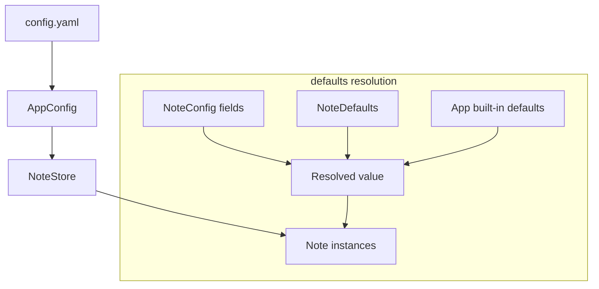
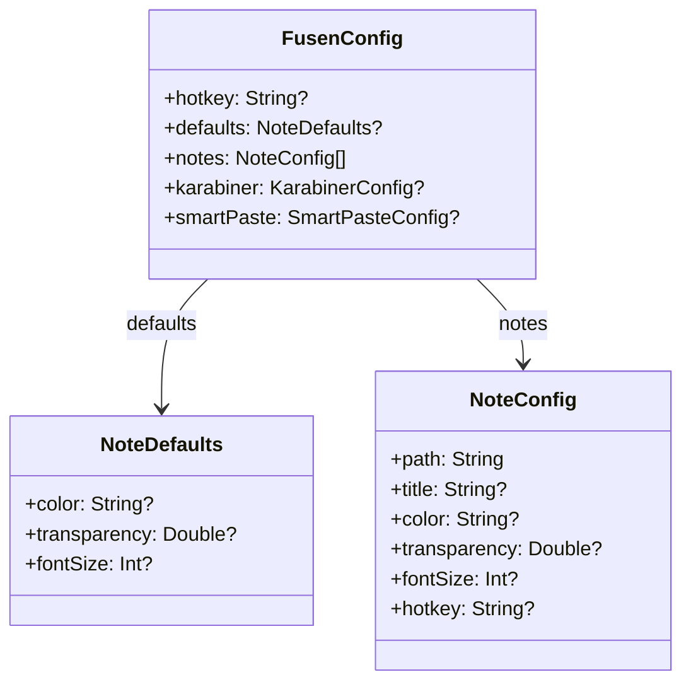

# Design Document: config-restructure

## Overview

**Purpose**: `defaults:` セクションを config.yaml に導入し、ノートの外観設定（color, transparency, font_size）を一括指定可能にする。

**Users**: config.yaml を手動編集するユーザーが、ノートごとの設定の繰り返しを省略できる。

**Impact**: `FusenConfig` に `defaults` フィールドを追加し、`NoteStore` のデフォルト値解決ロジックを3段階に拡張する。

### Goals

- `defaults:` セクションによる外観設定の一括指定
- アプリ組込みデフォルト → `defaults:` → 個別ノート指定の3段階解決
- 既存 config.yaml との完全な後方互換性

### Non-Goals

- Periodic note のサポート（別 spec）
- `app:` セクションの導入
- `id` フィールドの導入
- state.yaml の構造変更

## Architecture

### Existing Architecture Analysis

現在の設定解決フロー:

1. `AppConfig`（`YAMLStore<FusenConfig>`）が config.yaml をロード
2. `NoteStore.loadFromConfig()` が各 `NoteConfig` からハードコードされたデフォルト値で `Note` を生成
3. ハードコード箇所: `color: .yellow`, `transparency: 0.9`, `fontSize: 14`

変更後もこのフローは維持し、ステップ2のデフォルト値解決に `defaults:` を挟む。

### Architecture Pattern & Boundary Map

既存パターンをそのまま踏襲。新規コンポーネントや新規境界は追加しない。



**Architecture Integration**:
- Selected pattern: 既存の Singleton + Combine パターンを維持
- Existing patterns preserved: `YAMLStore`, `Codable`, `@Published` による Reactive 更新
- New components rationale: `NoteDefaults` 構造体のみ追加（データ定義のみ、ロジックなし）

### Technology Stack

| Layer | Choice / Version | Role in Feature | Notes |
|-------|------------------|-----------------|-------|
| Data / Storage | Yams (既存) | config.yaml の YAML パース | Optional フィールド追加で後方互換 |

既存スタックに変更・追加なし。

## Requirements Traceability

| Requirement | Summary | Components | Interfaces | Flows |
|-------------|---------|------------|------------|-------|
| 1.1 | defaults なしの config を従来通りロード | NoteDefaults, NoteStore | — | defaults resolution |
| 1.2 | 未知フィールドを無視 | FusenConfig | — | — |
| 2.1 | defaults セクションを受け付ける | FusenConfig, NoteDefaults | — | — |
| 2.2 | color, transparency, font_size の3フィールド | NoteDefaults | — | — |
| 2.3 | 個別指定が defaults を上書き | NoteStore | — | defaults resolution |
| 2.4 | 個別指定なしで defaults を適用 | NoteStore | — | defaults resolution |
| 2.5 | 両方なしでアプリデフォルトを適用 | NoteStore | — | defaults resolution |
| 2.6 | defaults の部分指定を許容 | NoteDefaults | — | — |
| 3.1 | hotkey をルートレベルで維持 | FusenConfig | — | — |
| 3.2 | karabiner をルートレベルで維持 | FusenConfig | — | — |
| 3.3 | notes をルートレベルで維持 | FusenConfig | — | — |
| 4.1 | 3段階のデフォルト値解決 | NoteStore | — | defaults resolution |
| 4.2 | title, hotkey は defaults 対象外 | NoteDefaults | — | — |

## Components and Interfaces

| Component | Domain | Intent | Req Coverage | Key Dependencies | Contracts |
|-----------|--------|--------|--------------|------------------|-----------|
| NoteDefaults | Config | 外観デフォルト値の定義 | 2.1, 2.2, 2.6, 4.2 | — | State |
| FusenConfig | Config | defaults フィールドの追加 | 1.1, 1.2, 3.1-3.3 | NoteDefaults | State |
| NoteStore | Models | defaults 解決ロジック | 2.3-2.5, 4.1 | FusenConfig (P0) | — |

### Config Layer

#### NoteDefaults

| Field | Detail |
|-------|--------|
| Intent | ノートの外観デフォルト値を保持する Codable 構造体 |
| Requirements | 2.1, 2.2, 2.6, 4.2 |

**Responsibilities & Constraints**
- `color`, `transparency`, `fontSize` の3フィールドのみ保持
- 全フィールド Optional（部分指定を許容）
- `title`, `hotkey` は含まない（ノート固有のため）

**Contracts**: State [x]

##### State Management

```swift
struct NoteDefaults: Codable {
    var color: String?
    var transparency: Double?
    var fontSize: Int?

    enum CodingKeys: String, CodingKey {
        case color, transparency
        case fontSize = "font_size"
    }
}
```

#### FusenConfig（変更）

| Field | Detail |
|-------|--------|
| Intent | defaults フィールドを追加 |
| Requirements | 1.1, 1.2, 3.1-3.3 |

**Responsibilities & Constraints**
- `defaults: NoteDefaults?` を追加
- `hotkey`, `notes`, `karabiner`, `smartPaste` はルートレベルで維持
- `CodingKeys` に `defaults` を追加

**Contracts**: State [x]

##### State Management

```swift
struct FusenConfig: Codable {
    var hotkey: String?
    var defaults: NoteDefaults?  // 追加
    var notes: [NoteConfig] = []
    var karabiner: KarabinerConfig?
    var smartPaste: SmartPasteConfig?

    enum CodingKeys: String, CodingKey {
        case hotkey, defaults, notes, karabiner
        case smartPaste = "smart_paste"
    }
}
```

### Models Layer

#### NoteStore（変更）

| Field | Detail |
|-------|--------|
| Intent | defaults を含む3段階のデフォルト値解決 |
| Requirements | 2.3, 2.4, 2.5, 4.1 |

**Responsibilities & Constraints**
- `loadFromConfig()` 内のデフォルト値解決を3段階に拡張
- 解決順序: `noteConfig.field` → `config.defaults?.field` → アプリ組込みデフォルト
- アプリ組込みデフォルト値: color=yellow, transparency=0.9, fontSize=14

**Dependencies**
- Inbound: AppConfig — 設定データの供給 (P0)

**Implementation Notes**
- `loadFromConfig()` の `??` チェーンを拡張するのみ。構造的な変更は不要

## Data Models

### Domain Model



### Physical Data Model

config.yaml のスキーマ変更:

```yaml
# 追加: ルートレベルの defaults セクション
defaults:        # Optional
  color: string        # Optional, NoteColor enum 値
  transparency: double # Optional, 0.0-1.0
  font_size: int       # Optional, ポイント数
```

既存フィールドへの変更なし。

## Error Handling

### Error Strategy

- `defaults:` に無効な `color` 値 → `NoteColor(rawValue:)` が `nil` を返し、アプリデフォルト `yellow` にフォールバック（既存の挙動と同じ）
- `defaults:` の `transparency` が範囲外 → そのまま適用（既存の NoteConfig と同じ挙動。バリデーションの追加はスコープ外）
- `defaults:` セクション自体のパースエラー → Yams がデコードエラーを出し、`YAMLStore` が既存のエラーハンドリングでデフォルト `FusenConfig()` を使用

## Testing Strategy

### Unit Tests

- `NoteDefaults` の Codable: YAML → struct → YAML のラウンドトリップ
- defaults 解決の3段階: 個別指定あり/defaults のみ/両方なし の各ケース
- defaults の部分指定: `color` のみ指定、他は nil

### Integration Tests

- 既存 config.yaml（defaults なし）でアプリが正常起動
- defaults 付き config.yaml でノートの外観が正しく反映
- config.yaml 外部変更時の file watcher → defaults 再解決
