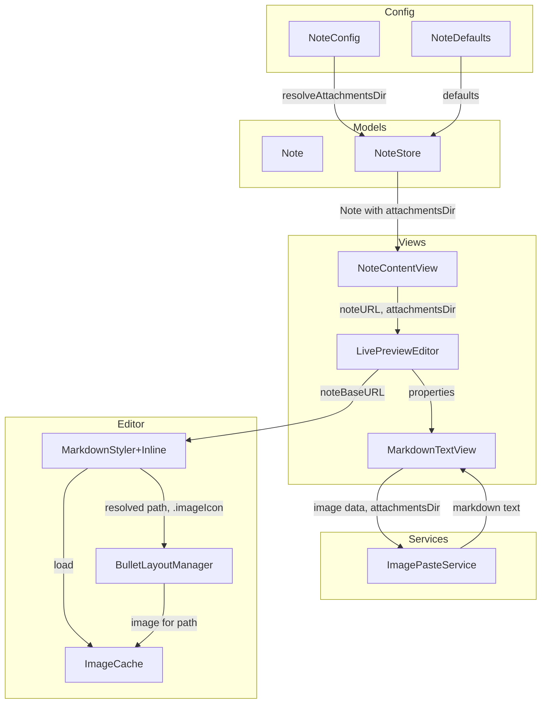
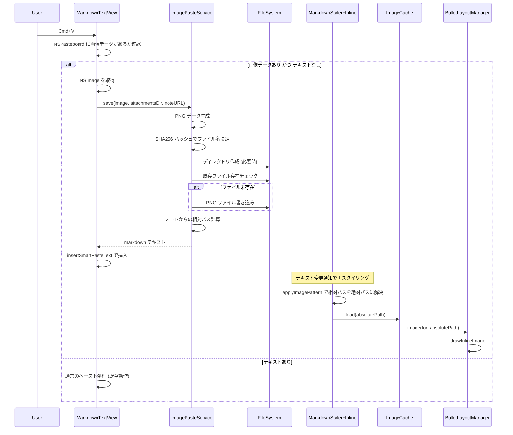
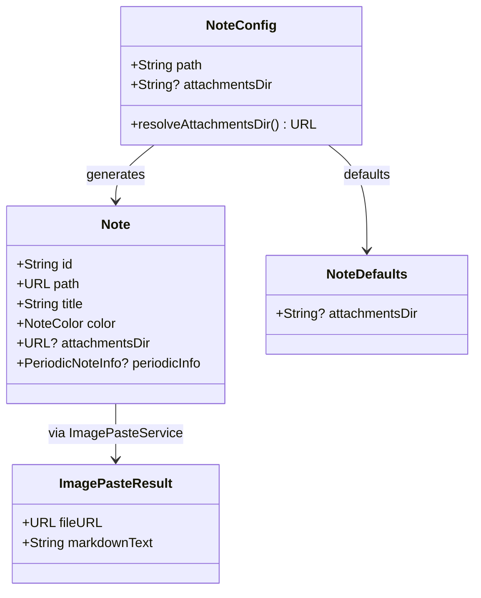

# Design Document: image-paste

## Overview

**Purpose**: クリップボードからの画像ペースト機能により、ユーザーはスクリーンショットや他アプリからコピーした画像を Cmd+V で付箋に貼り付け可能になる。画像は PNG ファイルとして永続化され、Markdown 画像構文でインラインレンダリングされる。

**Users**: Chirami ユーザーが、開発中のスクリーンショットや参考画像を付箋に素早く貼り付けるワークフローで利用する。

**Impact**: 既存のペースト処理パイプライン（SmartPasteService / MarkdownTextView）、設定モデル（ConfigModels）、画像レンダリングパイプライン（MarkdownStyler / ImageCache / BulletLayoutManager）を拡張する。

### Goals

- Cmd+V で画像をペーストし、PNG ファイルとして自動保存
- Markdown 画像構文の自動挿入と既存レンダリングパイプラインでのインライン表示
- 画像保存先ディレクトリのノートごと・グローバルでの設定
- コンテンツハッシュによる重複画像の防止

### Non-Goals

- 孤立画像ファイルの自動クリーンアップ
- Retina 画像の自動リサイズ
- ドラッグ＆ドロップによる画像追加
- 画像のリサイズ・トリミング UI

## Architecture

### Existing Architecture Analysis

Chirami は責務ごとに分割されたレイヤードアーキテクチャ（Models / Views / Editor / Config / Services）を採用している。本機能は各層を拡張する形で統合する。

- **Config 層**: `NoteConfig` / `NoteDefaults` の `resolve*` パターンが確立されており、`attachmentsDir` もこのパターンに従う
- **Services 層**: `SmartPasteService` がペースト検出・変換を担当。画像保存は新規 `ImagePasteService` として分離する
- **Editor 層**: `MarkdownStyler+Inline` → `.imageIcon` 属性 → `ImageCache` → `BulletLayoutManager` の画像レンダリングパイプラインが既に存在。相対パス解決の追加のみで対応可能
- **Views 層**: `MarkdownTextView` → `LivePreviewEditor` → `NoteWindow` のデータ受け渡しチェーンを拡張

### Architecture Pattern & Boundary Map



**Architecture Integration**:

- **Selected pattern**: 既存レイヤードアーキテクチャへの統合。各層の責務分離を維持しつつ拡張
- **Domain boundaries**: 画像保存ロジックは `ImagePasteService` に集約。設定解決は `ConfigModels`、レンダリングは Editor 層に留める
- **Existing patterns preserved**: `resolve*` パターン、`CodingKeys` による snake_case マッピング、`@MainActor` シングルトン、closure コールバック
- **New components**: `ImagePasteService` のみ新規。画像保存の責務を分離するために必要
- **Steering compliance**: レイヤー間の依存方向（Views → Services → Models、Editor は独立）を維持

### Technology Stack

| Layer | Choice / Version | Role in Feature | Notes |
|-------|------------------|-----------------|-------|
| Services | Swift 5.9+, CryptoKit | 画像の PNG 保存、SHA256 ハッシュによるファイル名生成 | CryptoKit は既存依存 |
| Config | Yams, Codable | `attachments_dir` 設定の読み書き | 既存の YAML パーサー |
| Editor | AppKit (NSAttributedString, NSLayoutManager) | 相対パス解決、画像レンダリング | 既存パイプライン拡張 |
| Views | AppKit (NSTextView, NSPasteboard) | クリップボード画像検出、ペースト処理 | NSPasteboard API |

## System Flows

### 画像ペーストフロー



画像ペーストフローの要点:

- 画像検出はテキスト不在を条件とする（要件 1.3）
- SHA256 ハッシュにより同一画像の再ペースト時にファイル書き込みをスキップ（要件 2.3）
- 相対パス解決は `applyImagePattern()` 内で行い、既存の `ImageCache` → `BulletLayoutManager` パイプラインは変更不要

## Requirements Traceability

| Requirement | Summary | Components | Interfaces | Flows |
|-------------|---------|------------|------------|-------|
| 1.1 | 画像クリップボード検出と処理開始 | MarkdownTextView | paste(_:) | 画像ペーストフロー |
| 1.2 | .tiff/.png タイプかつテキストなしで画像ペースト判定 | MarkdownTextView | paste(_:) | 画像ペーストフロー |
| 1.3 | テキスト+画像共存時はテキスト優先 | MarkdownTextView | paste(_:) | 画像ペーストフロー |
| 2.1 | PNG 形式でファイル保存 | ImagePasteService | save(image:to:noteURL:) | 画像ペーストフロー |
| 2.2 | SHA256 ハッシュプレフィックスのファイル名 | ImagePasteService | save(image:to:noteURL:) | 画像ペーストフロー |
| 2.3 | 同一画像の重複保存防止 | ImagePasteService | save(image:to:noteURL:) | 画像ペーストフロー |
| 2.4 | 保存先ディレクトリの自動作成 | ImagePasteService | save(image:to:noteURL:) | 画像ペーストフロー |
| 3.1 | カーソル位置に Markdown 画像構文挿入 | MarkdownTextView, ImagePasteService | insertSmartPasteText(_:), save(image:to:noteURL:) | 画像ペーストフロー |
| 3.2 | ノートからの相対パス計算 | ImagePasteService | save(image:to:noteURL:) | 画像ペーストフロー |
| 3.3 | 既存パイプラインによるインライン表示 | MarkdownStyler+Inline, ImageCache, BulletLayoutManager | applyImagePattern(), noteBaseURL | 画像ペーストフロー |
| 4.1 | グローバルデフォルト設定 | NoteDefaults | attachmentsDir property | — |
| 4.2 | ノートごとの設定 | NoteConfig | attachmentsDir property | — |
| 4.3 | ノートごと設定の優先 | NoteConfig | resolveAttachmentsDir(noteURL:defaults:) | — |
| 4.4 | 通常ノートのデフォルト保存先 | NoteConfig | resolveAttachmentsDir(noteURL:defaults:) | — |
| 4.5 | Periodic note のデフォルト保存先 | NoteConfig | resolveAttachmentsDir(noteURL:defaults:isPeriodicNote:pathTemplate:) | — |
| 4.6 | 相対パスの解決 | NoteConfig | resolveAttachmentsDir(noteURL:defaults:) | — |
| 4.7 | 絶対パスの使用 | NoteConfig | resolveAttachmentsDir(noteURL:defaults:) | — |
| 5.1 | 相対パスの絶対パス解決 | MarkdownStyler+Inline | applyImagePattern(), noteBaseURL | 画像ペーストフロー |
| 5.2 | Live Preview での画像インラインレンダリング | BulletLayoutManager, ImageCache | drawInlineImage(), .imageIcon | 画像ペーストフロー |

## Components and Interfaces

| Component | Domain/Layer | Intent | Req Coverage | Key Dependencies | Contracts |
|-----------|--------------|--------|--------------|------------------|-----------|
| ImagePasteService | Services | 画像の PNG 保存と Markdown テキスト生成 | 2.1-2.4, 3.1, 3.2 | CryptoKit (P0), FileManager (P0) | Service |
| NoteConfig (拡張) | Config | attachmentsDir 設定の解決 | 4.1-4.7 | NoteDefaults (P0) | Service |
| NoteDefaults (拡張) | Config | グローバルデフォルトの attachmentsDir | 4.1 | — | State |
| Note (拡張) | Models | attachmentsDir プロパティ保持 | 4.1-4.7 | — | State |
| NoteStore (拡張) | Models | Note 生成時に attachmentsDir を解決 | 4.1-4.7 | NoteConfig (P0) | — |
| MarkdownTextView (拡張) | Views | 画像ペースト検出と処理 | 1.1-1.3, 3.1 | ImagePasteService (P0) | Service |
| LivePreviewEditor (拡張) | Views | noteURL/attachmentsDir のブリッジ | 5.1 | MarkdownTextView (P0) | — |
| NoteContentView (拡張) | Views | note データの受け渡し | — | LivePreviewEditor (P1) | — |
| MarkdownStyler (拡張) | Editor | noteBaseURL による相対パス解決 | 5.1, 5.2 | ImageCache (P0) | State |

### Services

#### ImagePasteService

| Field | Detail |
|-------|--------|
| Intent | クリップボード画像を PNG ファイルとして保存し、Markdown 画像構文テキストを返す |
| Requirements | 2.1, 2.2, 2.3, 2.4, 3.1, 3.2 |

**Responsibilities & Constraints**

- NSImage を PNG データに変換し、指定ディレクトリに保存する
- SHA256 ハッシュプレフィックス (先頭16バイト) でファイル名を生成し、コンテンツベースの重複防止を実現する
- ノートファイルからの相対パスを計算し、Markdown 画像構文テキストを生成する
- 保存先ディレクトリが存在しない場合は自動作成する

**Dependencies**

- External: CryptoKit — SHA256 ハッシュ計算 (P0)
- External: FileManager — ファイル I/O (P0)

**Contracts**: Service [x]

##### Service Interface

```swift
struct ImagePasteResult {
    let fileURL: URL
    let markdownText: String
}

enum ImagePasteError: Error {
    case pngConversionFailed
    case fileWriteFailed(Error)
    case directoryCreationFailed(Error)
}

protocol ImagePasteServiceProtocol {
    func save(image: NSImage, to attachmentsDir: URL, noteURL: URL) -> Result<ImagePasteResult, ImagePasteError>
}
```

- Preconditions: `image` は有効な NSImage、`noteURL` は既存のノートファイルパス
- Postconditions: PNG ファイルが `attachmentsDir` に保存され、ノートからの相対パスを含む Markdown テキストが返される
- Invariants: 同一画像コンテンツに対して同一ファイル名が生成される（SHA256 ハッシュの決定性）

### Config

#### NoteConfig (拡張) — resolveAttachmentsDir

| Field | Detail |
|-------|--------|
| Intent | ノートの添付ファイル保存先ディレクトリを設定優先順位に基づいて解決する |
| Requirements | 4.1, 4.2, 4.3, 4.4, 4.5, 4.6, 4.7 |

**Responsibilities & Constraints**

- 優先順位: ノート固有設定 → グローバルデフォルト → フォールバック値
- フォールバック: 通常ノートは `<note-stem>.attachments/`、periodic note はテンプレートの親ディレクトリ + `attachments/`
- 相対パスはノートファイルの親ディレクトリからの相対として解決
- `~/` は `FileManager.realHomeDirectory` で展開

**Dependencies**

- Inbound: NoteDefaults — グローバルデフォルト値 (P0)
- External: PathTemplateResolver — periodic note のベースディレクトリ抽出 (P1)

**Contracts**: Service [x]

##### Service Interface

```swift
extension NoteConfig {
    func resolveAttachmentsDir(
        noteURL: URL,
        defaults: NoteDefaults?,
        isPeriodicNote: Bool,
        pathTemplate: String?
    ) -> URL
}
```

- Preconditions: `noteURL` は有効なファイル URL
- Postconditions: 有効なディレクトリ URL が返される（ディレクトリの存在は保証しない）
- Invariants: 同一入力に対して常に同一の URL が返される

パス解決ルール:

1. `attachmentsDir`（ノート固有）または `defaults.attachmentsDir`（グローバル）が設定されている場合:
   - `~/` 始まり → ホームディレクトリ展開
   - `/` 始まり → 絶対パスとして使用
   - それ以外 → `noteURL` の親ディレクトリからの相対パス
2. 未設定の場合:
   - 通常ノート: `noteURL.deletingPathExtension().lastPathComponent` + `.attachments/`（ノートと同ディレクトリ）
   - Periodic note: `PathTemplateResolver.extractBaseDirectory(from: pathTemplate)` + `attachments/`

### Views

#### MarkdownTextView (拡張) — 画像ペースト処理

| Field | Detail |
|-------|--------|
| Intent | Cmd+V での画像ペーストを検出し、ImagePasteService 経由で保存・Markdown 挿入を行う |
| Requirements | 1.1, 1.2, 1.3, 3.1 |

**Responsibilities & Constraints**

- `paste(_:)` オーバーライドで NSPasteboard の画像データを検出
- テキストと画像が共存する場合はテキストペーストを優先（既存動作を維持）
- 画像ペースト成功時は `insertSmartPasteText(_:)` で Markdown テキストを挿入
- `noteURL` と `attachmentsDir` プロパティを保持し、画像保存先の決定に使用

**Dependencies**

- Outbound: ImagePasteService — 画像保存と Markdown テキスト生成 (P0)

**Contracts**: Service [x]

##### Service Interface

```swift
extension MarkdownTextView {
    var noteURL: URL? { get set }
    var attachmentsDir: URL? { get set }

    override func paste(_ sender: Any?)
    // NSPasteboard に .tiff/.png があり、かつ有意なテキストがない場合:
    //   ImagePasteService.save() を呼び出し、結果の markdownText を insertSmartPasteText() で挿入
    // それ以外: super.paste(sender) に委譲
}
```

- Preconditions: `noteURL` と `attachmentsDir` が設定されていること（nil の場合は画像ペースト無効）
- Postconditions: 画像ファイルが保存され、カーソル位置に Markdown テキストが挿入される

#### LivePreviewEditor (拡張)

`noteURL: URL?` と `attachmentsDir: URL?` パラメータを追加し、`makeNSView` / `updateNSView` で `MarkdownTextView` のプロパティに設定する。また、`applyStyling()` で `styler.noteBaseURL` を `noteURL` の親ディレクトリに設定する。

#### NoteContentView (拡張)

`LivePreviewEditor` の呼び出し時に `note?.path` と `note?.attachmentsDir` を渡す。

### Editor

#### MarkdownStyler (拡張) — 相対パス解決

| Field | Detail |
|-------|--------|
| Intent | Markdown 画像構文の相対パスをノートファイル基準で絶対パスに解決する |
| Requirements | 5.1, 5.2 |

**Responsibilities & Constraints**

- `noteBaseURL: URL?` プロパティを保持（ノートファイルの親ディレクトリ）
- `applyImagePattern()` 内で、画像パスが相対パスの場合に `noteBaseURL` を基準に絶対パスへ解決
- 解決済みの絶対パスを `.imageIcon` 属性と `ImageCache.load()` の両方に一貫して使用
- HTTP/HTTPS URL や既存の絶対パスはそのまま維持

**Dependencies**

- Outbound: ImageCache — 解決済みパスでの画像ロード (P0)
- Outbound: BulletLayoutManager — `.imageIcon` 属性値の一貫性 (P0)

**Contracts**: State [x]

##### State Management

- State model: `noteBaseURL: URL?` — ノートファイルの親ディレクトリ。`applyStyling()` で毎回設定される
- Persistence: なし（スタイリングサイクルごとに設定）
- Concurrency: メインスレッドのみ（`@MainActor` スコープ）

パス解決ロジック:

- `http://` または `https://` 始まり → そのまま（HTTP URL）
- `/` 始まり → そのまま（絶対パス）
- `~/` 始まり → そのまま（チルダパス、ImageCache が展開）
- それ以外 → `noteBaseURL?.appendingPathComponent(path).path`（相対パス解決）

## Data Models

### Domain Model



- `Note.attachmentsDir` は `NoteConfig.resolveAttachmentsDir()` で解決された値を保持する
- `ImagePasteResult` は一時的な値オブジェクトで、画像保存とテキスト挿入の結果を返す

### Logical Data Model

**ファイルシステム上の構造**:

```
~/notes/
  todo.md                           # ノートファイル
  todo.attachments/                 # デフォルトの添付ディレクトリ
    image-a1b2c3d4e5f6...png        # SHA256 ハッシュプレフィックスのファイル名
  daily/
    2026-02-26.md                   # Periodic note
    attachments/                    # Periodic note 共有の添付ディレクトリ
      image-f6e5d4c3b2a1...png
```

**ファイル名生成規則**:

- 形式: `image-<SHA256先頭16バイトのhex>.png`
- 入力: NSImage の PNG 表現バイト列
- 一意性: 32文字の hex (128ビット) で実用上衝突なし

## Error Handling

### Error Strategy

画像ペーストのエラーは、ユーザーの操作フローを中断させないことを優先する。

### Error Categories and Responses

**User Errors**:

- `noteURL` / `attachmentsDir` が nil → 画像ペースト無効、通常ペースト（`super.paste`）にフォールバック

**System Errors**:

- PNG 変換失敗 → NSLog でログ出力、通常ペーストにフォールバック
- ディレクトリ作成失敗 → NSLog でログ出力、通常ペーストにフォールバック
- ファイル書き込み失敗 → NSLog でログ出力、通常ペーストにフォールバック

すべてのエラーケースで通常ペースト動作にフォールバックし、ユーザーの操作を阻害しない。

## Testing Strategy

### Unit Tests

- `ImagePasteService.save()`: PNG 保存、SHA256 ファイル名生成、重複防止、ディレクトリ自動作成
- `NoteConfig.resolveAttachmentsDir()`: 未設定/相対パス/絶対パス/チルダパス/periodic note の各パターン
- 相対パス計算: ノートファイルと添付ディレクトリの各種位置関係

### Integration Tests

- ペーストフロー全体: NSPasteboard への画像セット → `paste(_:)` → ファイル保存 → Markdown 挿入
- 画像レンダリング: 相対パスの Markdown 画像構文 → `applyImagePattern()` → `ImageCache` → `BulletLayoutManager`
- 設定反映: `config.yaml` の `attachments_dir` 変更 → Note 再生成 → 保存先変更

### E2E Tests

- スクリーンショットのペースト → PNG 保存 → インラインレンダリング確認
- 同一画像の再ペースト → ファイル重複なし確認
- Periodic note での画像ペースト → 共有添付ディレクトリへの保存確認
- `config.yaml` での保存先変更 → 新しいパスへの保存確認
