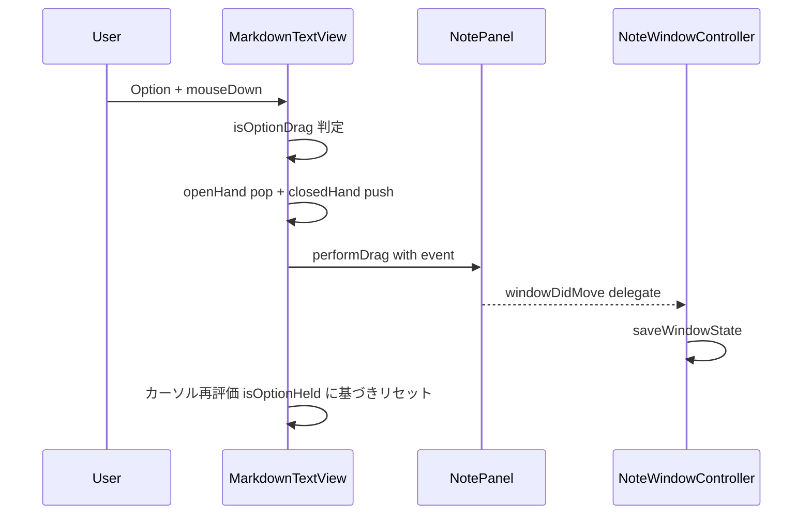
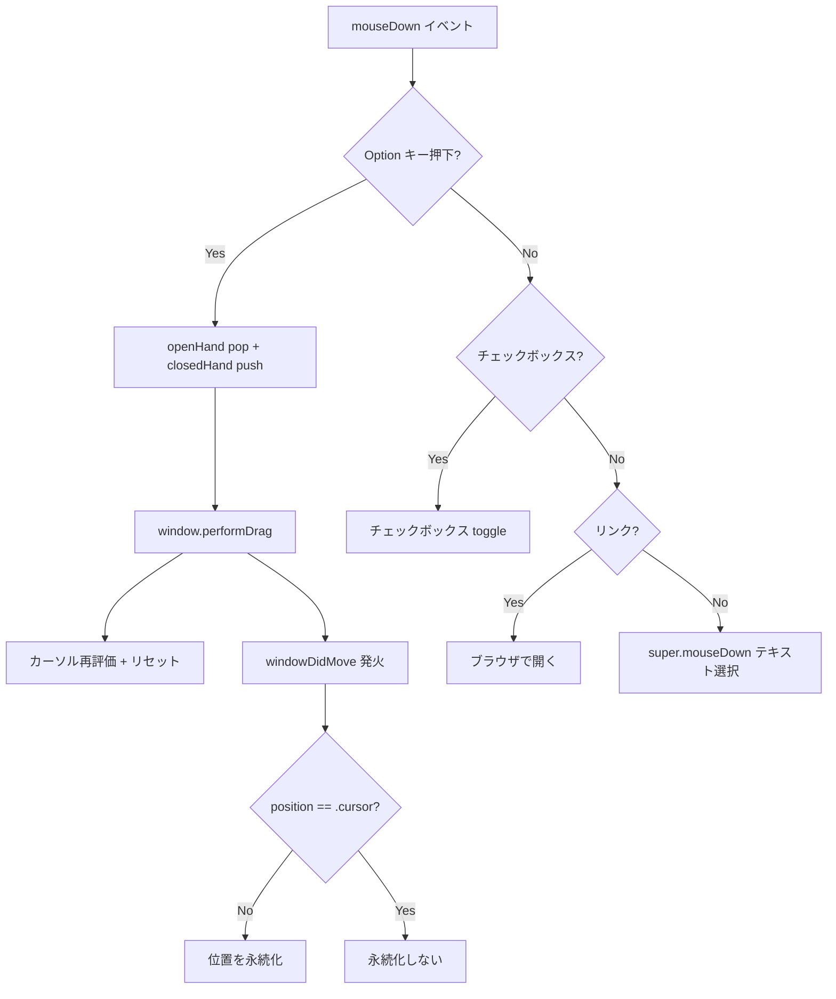
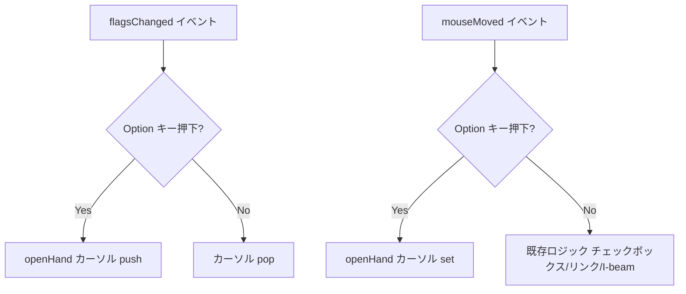

# Design Document

## Overview

**Purpose**: Option キー + ドラッグによるウィンドウ移動機能を MarkdownTextView に追加し、コンテンツ領域からもウィンドウを移動可能にする。

**Users**: Fusen ユーザーが付箋の位置調整時に利用する。

**Impact**: MarkdownTextView のマウスイベント処理に修飾キー判定を追加し、`NSWindow.performDrag(with:)` でウィンドウドラッグを開始する。

### Goals

- コンテンツ領域上で Option + ドラッグによるウィンドウ移動を実現
- 移動モードの視覚的フィードバック (open hand / closed hand カーソル)
- 既存のテキスト編集・チェックボックス・リンク操作との完全な互換性

### Non-Goals

- 修飾キーのカスタマイズ設定
- ドラッグ中のスナップガイドやグリッド機能
- タッチパッド固有のジェスチャー対応

## Architecture

### Existing Architecture Analysis

現在の MarkdownTextView のマウスイベント処理フロー:

1. `mouseDown` — チェックボックス → リンク → `super.mouseDown` (テキスト選択)
2. `mouseMoved` — チェックボックス/リンク上は pointing hand、それ以外は I-beam
3. Option キーは未使用

変更対象は MarkdownTextView のみ。NotePanel、NoteWindowController、WindowManager への変更は不要。`performDrag(with:)` 完了後に `windowDidMove` デリゲートが呼ばれるため、既存の位置永続化ロジックはそのまま動作する。

### Architecture Pattern & Boundary Map

**Architecture Integration**:

- **Selected pattern**: 既存の NSTextView イベントハンドリングパターンを拡張
- **Domain boundaries**: MarkdownTextView 内にドラッグ判定とカーソル制御を閉じ込め、ウィンドウ層には `performDrag` 経由でのみ伝播
- **Existing patterns preserved**: mouseDown の優先チェーンパターン、windowDidMove による位置永続化
- **New components rationale**: 新規コンポーネントなし。既存の MarkdownTextView にメソッドを追加

### Technology Stack

| Layer | Choice / Version | Role in Feature | Notes |
|-------|------------------|-----------------|-------|
| UI | AppKit (NSTextView, NSCursor, NSWindow) | マウスイベント処理、カーソル変更、ウィンドウドラッグ | 既存依存、追加ライブラリなし |

## System Flows

### Option + ドラッグによるウィンドウ移動フロー

### カーソル変更フロー

## Requirements Traceability

| Requirement | Summary | Components | Interfaces | Flows |
|-------------|---------|------------|------------|-------|
| 1.1 | Option+ドラッグでウィンドウ移動 | MarkdownTextView | mouseDown override | Option+ドラッグフロー |
| 1.2 | 修飾キーなしは従来通りテキスト選択 | MarkdownTextView | mouseDown override | mouseDown 分岐 |
| 1.3 | 移動後のウィンドウ位置永続化 | NoteWindowController (既存) | windowDidMove | windowDidMove → saveWindowState |
| 2.1 | Option 押下中に open hand カーソル | MarkdownTextView | flagsChanged, mouseMoved | カーソル変更フロー |
| 2.2 | ドラッグ開始時に closed hand カーソル | MarkdownTextView | mouseDown override | Option+ドラッグフロー |
| 2.3 | Option 解放時にカーソル復帰 | MarkdownTextView | flagsChanged | カーソル変更フロー |
| 3.1 | テキストクリック互換性 | MarkdownTextView | mouseDown override | mouseDown 分岐 |
| 3.2 | チェックボックスクリック互換性 | MarkdownTextView | mouseDown override | mouseDown 分岐 |
| 3.3 | リンククリック互換性 | MarkdownTextView | mouseDown override | mouseDown 分岐 |
| 3.4 | タイトルバードラッグ互換性 | NotePanel (既存) | — | 変更なし |
| 3.5 | .cursor モードでの非永続化 | NoteWindowController (既存) | windowDidMove | windowDidMove 分岐 |

## Components and Interfaces

| Component | Domain/Layer | Intent | Req Coverage | Key Dependencies | Contracts |
|-----------|-------------|--------|--------------|-----------------|-----------|
| MarkdownTextView | Views / UI | Option+ドラッグによるウィンドウ移動とカーソル制御 | 1.1, 1.2, 2.1, 2.2, 2.3, 3.1, 3.2, 3.3 | NotePanel (P0) | State |
| NotePanel | Views / UI | performDrag の受け手 (既存、変更なし) | 3.4 | — | — |
| NoteWindowController | Views / UI | windowDidMove で位置永続化 (既存、変更なし) | 1.3, 3.5 | NoteStore (P0) | — |

### Views Layer

#### MarkdownTextView (拡張)

| Field | Detail |
|-------|--------|
| Intent | Option+ドラッグでウィンドウ移動を開始し、カーソルで操作状態をフィードバックする |
| Requirements | 1.1, 1.2, 2.1, 2.2, 2.3, 3.1, 3.2, 3.3 |

**Responsibilities & Constraints**

- mouseDown で Option キーの有無を最優先でチェックし、ウィンドウドラッグまたは既存処理に分岐する
- flagsChanged と mouseMoved で Option キー状態に応じたカーソル切り替え
- `performDrag` 前後でカーソルスタックを明示的にリセットし、push/pop の不整合を防ぐ

**Dependencies**

- Outbound: NSWindow (`performDrag(with:)`) — ウィンドウドラッグ開始 (P0)

**Contracts**: State [x]

##### State Management

- **State model**: `isOptionHeld: Bool` — Option キーの押下状態をトラッキングするインスタンス変数
- **Persistence**: なし (揮発性、ウィンドウ移動の永続化は NoteWindowController が担当)
- **Concurrency**: メインスレッドのみ (NSTextView はメインスレッド専用)

**Implementation Notes**

- `mouseDown(with:)` の冒頭で `event.modifierFlags.contains(.option)` をチェックし、true なら `window?.performDrag(with: event)` を呼んで早期 return する。これにより既存のチェックボックス/リンク/テキスト選択処理に到達しない
- `flagsChanged(with:)` を override し、Option の押下/解放に応じて `NSCursor.openHand.push()` / `NSCursor.pop()` を呼ぶ。`isOptionHeld` フラグで二重 push を防止する
- `mouseMoved(with:)` の冒頭で Option キーチェックを追加し、押下中は `NSCursor.openHand.set()` を呼んで既存のチェックボックス/リンクカーソル処理をスキップする
- `performDrag` 前後のカーソル管理: `performDrag` はイベントループを占有するため、ドラッグ中に Option キーが離された場合 `flagsChanged` の配信タイミングが不確定になる。そのため push/pop のネストではなく明示的なリセット方式を採用する:
  1. `performDrag` 呼び出し前: openHand が push 済みなら pop し、closedHand を push
  2. `performDrag` 完了後: closedHand を pop し、`isOptionHeld` の現在値を `event.modifierFlags` で再評価。Option が押されていれば openHand を push、そうでなければ `isOptionHeld = false` でクリーンな状態に戻す

## Testing Strategy

### Unit Tests

- Option+mouseDown イベント発行時に `performDrag` が呼ばれることの検証
- 修飾キーなし mouseDown で既存処理 (チェックボックス、リンク、テキスト選択) が動作することの検証
- `flagsChanged` で isOptionHeld フラグが正しく切り替わることの検証

### Integration Tests

- Option+ドラッグ後に `windowDidMove` が発火し、`.fixed` モードで位置が永続化されることの検証
- `.cursor` モードで Option+ドラッグ後に位置が永続化されないことの検証

### E2E / Manual Tests

- コンテンツ領域で Option+ドラッグしてウィンドウが移動することの確認
- Option 押下中にカーソルが open hand に変わることの確認
- ドラッグ中にカーソルが closed hand に変わることの確認
- Option 解放後にカーソルが I-beam に戻ることの確認
- 修飾キーなしでのテキスト選択、チェックボックスクリック、リンククリックが正常動作することの確認
