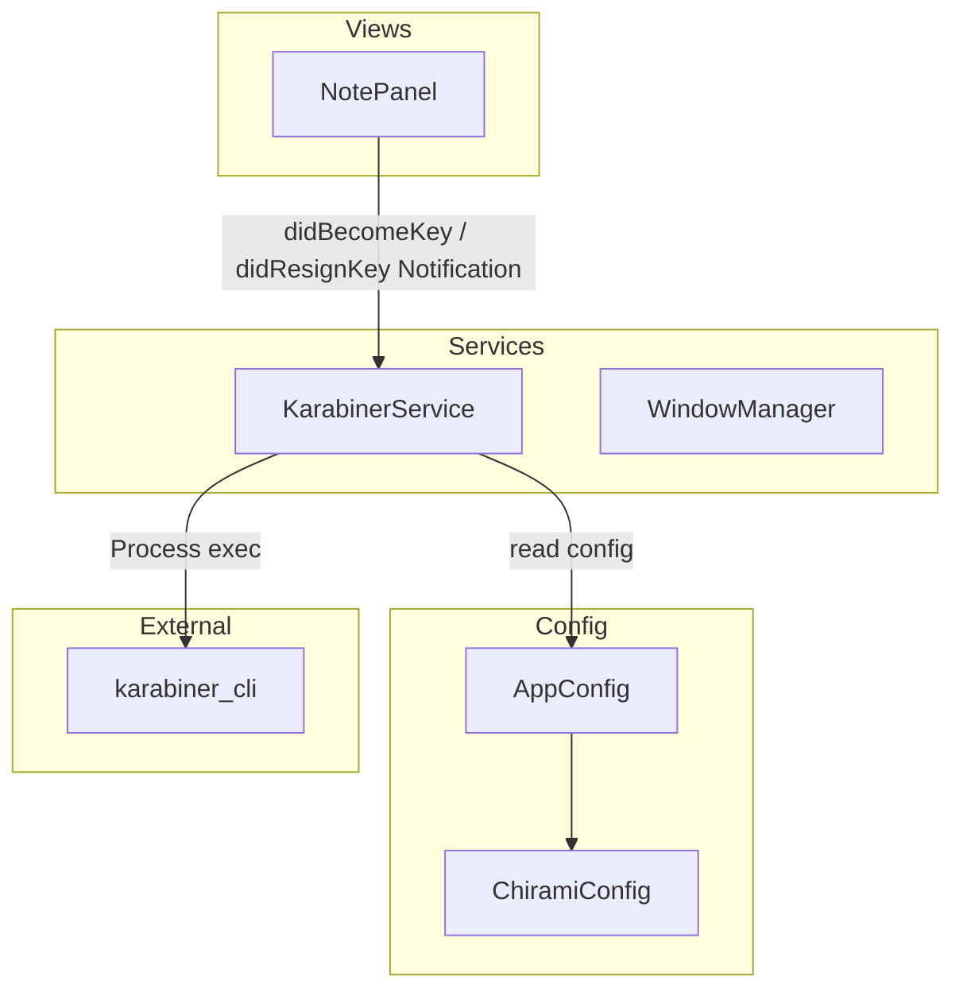
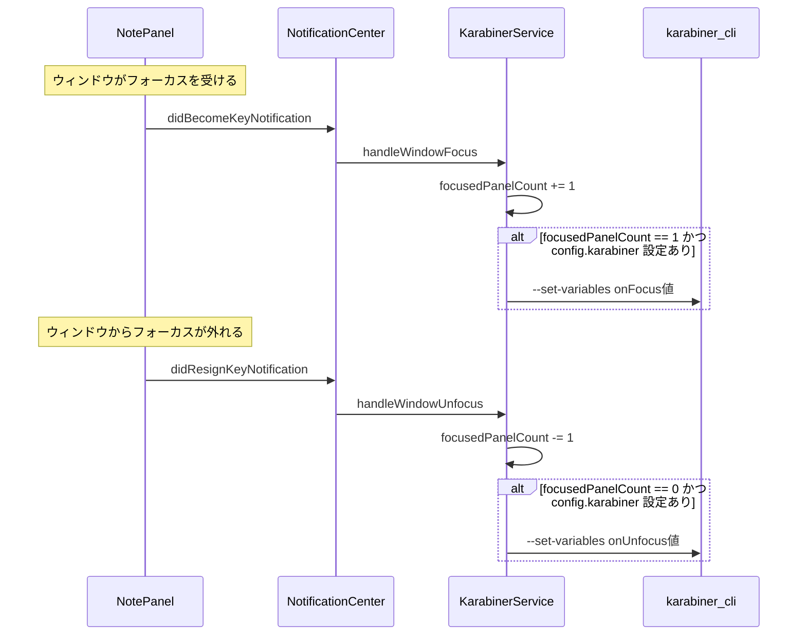

# Design Document: karabiner-variable-on-focus

## Overview

**Purpose**: Chirami ウィンドウのフォーカス状態に連動して Karabiner-Elements 変数を設定する機能を提供する。NSPanel ベースのフローティングウィンドウは macOS の frontmost app を変更しないため、`app_if` / `app_unless` 条件が使えない問題を解決する。

**Users**: Karabiner-Elements でキーバインドをカスタマイズしているユーザーが、Chirami フォーカス時に専用のキーバインドを適用するために使用する。

**Impact**: 既存のフォーカス処理やウィンドウ管理には影響しない。新規サービスの追加と設定モデルの拡張のみ。

### Goals

- Chirami ウィンドウフォーカス時に `karabiner_cli --set-variables` で変数を設定する
- フォーカス解除時に変数を元の値に戻す
- `config.yaml` で変数名・値をカスタマイズ可能にする
- 設定未定義時はデフォルト無効 (既存ユーザーへの影響なし)

### Non-Goals

- Karabiner-Elements の設定ファイル (`karabiner.json`) の自動編集
- ノート単位での異なる変数設定
- Karabiner-Elements 変数の読み取り (CLI がサポートしていない)

## Architecture

### Existing Architecture Analysis

- **サービス層パターン**: `@MainActor` シングルトン (`WindowManager`, `GlobalHotkeyService`)。`AppDelegate` でインスタンスを保持
- **設定システム**: `ChiramiConfig` (Codable) + `YAMLStore<T>` + `FileWatcher` による自動リロード
- **フォーカスイベント**: `LivePreviewEditor` が `NSWindow.didBecomeKeyNotification` / `didResignKeyNotification` を NotificationCenter で監視 (スタイリング目的)
- **外部プロセス実行**: 既存コードベースに前例なし

### Architecture Pattern & Boundary Map



- **Selected pattern**: 既存のサービス層パターン (`@MainActor` singleton) を踏襲
- **Domain boundary**: KarabinerService は Karabiner-Elements 連携のみを担当。フォーカスイベントの検知は NotificationCenter 経由で NotePanel から受け取る
- **Existing patterns preserved**: `@MainActor` + `static let shared`、Combine による設定変更の購読
- **New component rationale**: フォーカス集約ロジック + 外部プロセス実行は既存サービスの責務外

### Technology Stack

| Layer | Choice / Version | Role in Feature | Notes |
|-------|------------------|-----------------|-------|
| Services | Foundation `Process` | `karabiner_cli` の実行 | 標準ライブラリ。追加依存なし |
| Events | NotificationCenter | ウィンドウフォーカスイベントの監視 | 既存パターンと一貫 |
| Config | Yams (既存) | YAML パース | 追加依存なし |

## System Flows

### フォーカス→変数設定フロー



- `focusedPanelCount` で複数ウィンドウ間のフォーカス遷移を管理
- unfocus 処理に `DispatchQueue.main.async` による 1 RunLoop 遅延を入れ、直後の becomeKey でキャンセルする。これにより NotePanel A → NotePanel B のフォーカス遷移時に冗長な unfocus→focus の CLI 呼び出しを抑制する

## Requirements Traceability

| Requirement | Summary | Components | Interfaces | Flows |
|-------------|---------|------------|------------|-------|
| 1.1 | フォーカス時に変数設定 | KarabinerService | Service Interface | フォーカス→変数設定フロー |
| 1.2 | 全ウィンドウ unfocus 時に変数解除 | KarabinerService | Service Interface | フォーカス→変数設定フロー |
| 2.1 | 変数名の設定 | KarabinerConfig, ChiramiConfig | State | - |
| 2.2 | フォーカス時の値の設定 | KarabinerConfig | State | - |
| 2.3 | フォーカス解除時の値の設定 | KarabinerConfig | State | - |
| 2.4 | 未設定時はデフォルト無効 | KarabinerService | Service Interface | - |
| 3.1 | karabiner_cli による変数設定 | KarabinerService | Service Interface | フォーカス→変数設定フロー |
| 3.2 | CLI 失敗時のエラーハンドリング | KarabinerService | Service Interface | - |

## Components and Interfaces

| Component | Domain/Layer | Intent | Req Coverage | Key Dependencies | Contracts |
|-----------|--------------|--------|--------------|------------------|-----------|
| KarabinerService | Services | フォーカス監視 + CLI 実行 | 1.1, 1.2, 2.4, 3.1, 3.2 | AppConfig (P0), karabiner_cli (P1) | Service, State |
| KarabinerConfig | Config | Karabiner 連携設定の定義 | 2.1, 2.2, 2.3 | - | State |
| ChiramiConfig (拡張) | Config | karabiner プロパティ追加 | 2.1, 2.2, 2.3, 2.4 | - | State |

### Services

#### KarabinerService

| Field | Detail |
|-------|--------|
| Intent | Chirami ウィンドウのフォーカス状態を追跡し、Karabiner-Elements 変数を `karabiner_cli` 経由で設定する |
| Requirements | 1.1, 1.2, 2.4, 3.1, 3.2 |

**Responsibilities & Constraints**

- NotificationCenter で `NSWindow.didBecomeKeyNotification` / `didResignKeyNotification` を監視
- 通知元が `NotePanel` であることをフィルタリング
- `focusedPanelCount` で全 NotePanel のフォーカス状態を集約 (0 → 1 で focus、1 → 0 で unfocus)
- unfocus 判定に `DispatchQueue.main.async` で 1 RunLoop の遅延を入れ、直後の becomeKey でキャンセルすることで、ウィンドウ間遷移時の冗長な CLI 呼び出しを抑制する
- `karabiner_cli` をバックグラウンドで非同期実行 (`Task.detached`)
- 同じ値の再設定はスキップ (冗長な CLI 呼び出しを回避)

**Dependencies**

- Inbound: NotificationCenter — `NotePanel` のフォーカスイベント受信 (P0)
- Outbound: AppConfig — 設定値の読み取り (P0)
- External: `karabiner_cli` — 変数設定の実行 (P1)

**Contracts**: Service [x] / State [x]

##### Service Interface

```swift
@MainActor
class KarabinerService {
    static let shared: KarabinerService

    /// NotificationCenter のオブザーバを登録し、フォーカス監視を開始する
    func startObserving() -> Void

    /// NotificationCenter のオブザーバを解除する
    func stopObserving() -> Void
}
```

- Preconditions: `AppConfig.shared` が利用可能であること
- Postconditions: `startObserving()` 後、NotePanel のフォーカス変更に反応して `karabiner_cli` が実行される
- Invariants: `focusedPanelCount >= 0`

##### State Management

- `focusedPanelCount: Int` — 現在フォーカスを持つ NotePanel の数
- `lastSetValue: Int?` — 最後に設定した値 (冗長な CLI 呼び出し防止用)
- `pendingUnfocusWorkItem: DispatchWorkItem?` — unfocus 遅延処理のキャンセル用
- Persistence: なし (実行時のみのメモリ内状態)
- Concurrency: `@MainActor` で保護。CLI 実行のみ `Task.detached` でバックグラウンド

**Implementation Notes**

- Integration: `AppDelegate.applicationDidFinishLaunching` で `KarabinerService.shared.startObserving()` を呼び出す
- Validation: `config.karabiner` が `nil` の場合、CLI 実行をスキップ
- Risks: `karabiner_cli` が存在しない場合は `FileManager.fileExists` で事前チェックし、ログ出力のみで処理を続行

### Config

#### KarabinerConfig

| Field | Detail |
|-------|--------|
| Intent | Karabiner-Elements 連携に必要な設定値を定義する |
| Requirements | 2.1, 2.2, 2.3 |

**Contracts**: State [x]

##### State Management

```swift
struct KarabinerConfig: Codable {
    /// Karabiner-Elements に設定する変数名
    var variable: String
    /// フォーカス時に設定する値
    var onFocus: Int
    /// フォーカス解除時に設定する値
    var onUnfocus: Int
}
```

- `variable`: Karabiner-Elements の `variable_if` / `variable_unless` で参照する変数名
- `onFocus` / `onUnfocus`: 整数値 (Karabiner-Elements の変数は number が標準的)

#### ChiramiConfig (拡張)

| Field | Detail |
|-------|--------|
| Intent | `karabiner` プロパティを追加し、KarabinerConfig をオプショナルに保持する |
| Requirements | 2.1, 2.2, 2.3, 2.4 |

**Contracts**: State [x]

##### State Management

```swift
struct ChiramiConfig: Codable {
    var hotkey: String?
    var notes: [NoteConfig] = []
    var karabiner: KarabinerConfig?  // 追加
}
```

- `karabiner` が `nil` の場合、KarabinerService は CLI 実行を行わない (2.4)

## Data Models

### Domain Model

config.yaml に以下のセクションを追加:

```yaml
karabiner:
  variable: chirami_focused
  on_focus: 1
  on_unfocus: 0
```

- `variable`: 設定する Karabiner-Elements 変数名
- `on_focus`: フォーカス時に設定する整数値
- `on_unfocus`: フォーカス解除時に設定する整数値

`KarabinerConfig` の YAML キーは snake_case、Swift プロパティは camelCase。`CodingKeys` で `on_focus` → `onFocus`、`on_unfocus` → `onUnfocus` をマッピングする。

## Error Handling

### Error Strategy

- **CLI 未インストール**: `karabiner_cli` のパスに対して `FileManager.default.fileExists` でチェック。存在しない場合はログ出力し、以降の CLI 呼び出しをスキップ
- **CLI 実行失敗**: `Process` の終了コードが 0 以外の場合、標準エラー出力をログに記録。アプリの動作は継続
- **設定未定義**: `config.karabiner == nil` の場合、何もしない。エラーとして扱わない

### Error Categories and Responses

- **System Errors**: `karabiner_cli` の実行失敗 → `print` でエラーログ出力。Chirami のコア機能に影響しない
- **Configuration Errors**: 不正な YAML → 既存の `YAMLStore` のエラーハンドリングに委譲

## Testing Strategy

### Unit Tests

- `KarabinerConfig` の Codable エンコード/デコード
- `ChiramiConfig` に `karabiner` フィールドがない場合 `nil` にデコードされること
- `focusedPanelCount` の増減ロジック (0→1 で focus、1→0 で unfocus)
- 同じ値の再設定がスキップされること

### Integration Tests

- `karabiner_cli` が存在しない環境でエラーにならないこと
- config.yaml の変更が `KarabinerService` の動作に反映されること
