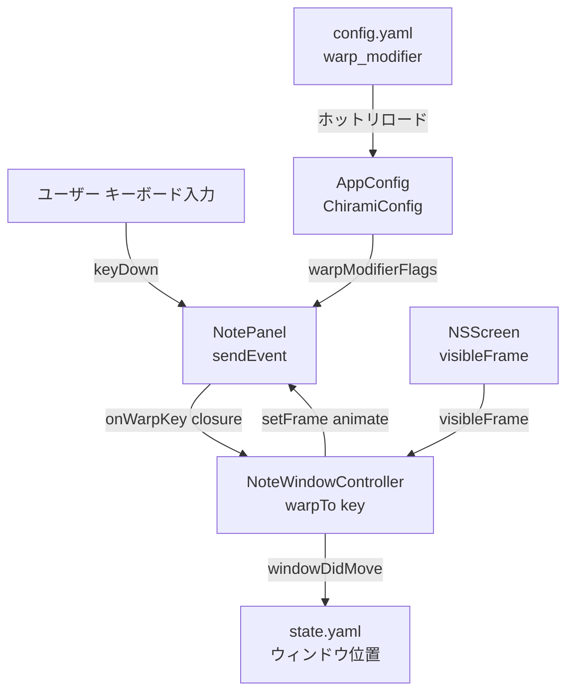
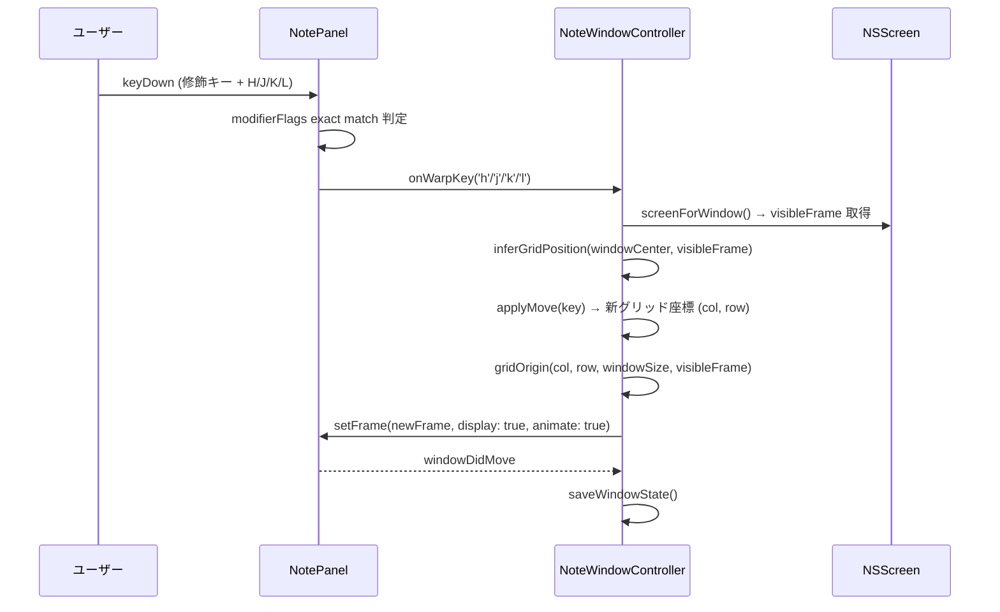

# Technical Design: keyboard-window-warp

## Overview

本機能は、付箋ウィンドウをキーボード（HJKL キー + 設定可能な修飾キー）で画面上の 3×3 グリッド 9 ポジションへワープさせる。マウスを使わず作業フローを維持したいユーザー（タイル型 WM 利用者、HHKB 等カーソルキー非搭載キーボードユーザー）のニーズに応える。

既存の `dragModifier` 設定・`NotePanel.sendEvent` パターンを踏襲した Extension として実装する。新規ライブラリは不要で、変更対象ファイルは 3 ファイルに限定される。

### Goals

- HJKL キーで 3×3 グリッド上を自由に移動でき、端でサイクルする
- `warp_modifier` フィールドで修飾キーを柔軟に設定でき、`config.yaml` 変更はホットリロードされる
- 手動ドラッグ後もグリッド移動が自然に機能する（ステートレス位置推定）
- マルチモニタ環境で付箋が現在表示されている画面内を基準にワープする

### Non-Goals

- 付箋非フォーカス時のグローバルホットキーによるワープ（スコープ外）
- グリッドサイズのカスタマイズ（固定 3×3）
- マージン値のカスタマイズ（固定 8pt）

## Architecture

### Existing Architecture Analysis

`dragModifier` 機能が完全に同じ構造を持ち、本機能はその Extension として実装する。

- `ChiramiConfig` — 設定フィールドと `NSEvent.ModifierFlags` への変換を担う
- `NotePanel.sendEvent` — ウィンドウ全体のイベントゲート。マウスイベント処理が既存
- `NoteWindowController` — ウィンドウ位置管理・保存を担う。`clampToScreen` 等の位置計算ロジックが既存

### Architecture Pattern & Boundary Map



**Architecture Integration**:
- 既存パターン `onXxx` クロージャで `NotePanel` → `NoteWindowController` を疎結合接続
- `AppConfig.shared.data.warpModifierFlags` を `sendEvent` 内で参照（`dragModifierFlags` と同一パターン）
- ワープ後の位置保存は既存 `windowDidMove` が自動実行するため追加実装不要

### Technology Stack

| Layer | Choice / Version | Role | Notes |
|-------|-----------------|------|-------|
| UI / Events | AppKit NSPanel | keyDown イベントインターセプト | sendEvent オーバーライドを拡張 |
| Config | Yams / ChiramiConfig | warp_modifier 設定の読み書き | dragModifier と同じ YAML キー命名規則 |
| Animation | AppKit NSWindow | setFrame animate:true | 既存 API。追加依存なし |

## System Flows



## Requirements Traceability

| Requirement | Summary | Components | インターフェース |
|-------------|---------|------------|----------------|
| 1.1 | 3×3グリッド定義 | NoteWindowController | `gridOrigin(col:row:windowSize:visibleFrame:)` |
| 1.2–1.5 | HJKL方向移動 | NotePanel, NoteWindowController | `onWarpKey`, `warpTo(key:)` |
| 1.6 | アニメーション | NoteWindowController | `setFrame(_:display:animate:)` |
| 1.7 | 8ptマージン | NoteWindowController | `gridOrigin` 内の定数 `margin = 8` |
| 2.1–2.4 | エッジサイクル | NoteWindowController | `applyMove(key:col:row:)` のモジュロ演算 |
| 3.1–3.3 | 位置推定 | NoteWindowController | `inferGridPosition(center:visibleFrame:)` |
| 4.1–4.4 | 修飾キー設定 | ChiramiConfig, NotePanel | `warpModifier`, `warpModifierFlags` |
| 5.1–5.3 | マルチモニタ | NoteWindowController | `screenForWindow()` |
| 6.1–6.2 | 位置永続化 | NoteWindowController | 既存 `windowDidMove` → `saveWindowState()` |

## Components and Interfaces

| Component | Layer | Intent | Req Coverage | 変更種別 |
|-----------|-------|--------|--------------|---------|
| ChiramiConfig | Config | warp_modifier 設定フィールドと ModifierFlags 変換 | 4.1–4.4 | 変更 |
| NotePanel | Views | keyDown インターセプト → onWarpKey 発火 | 1.2–1.5, 4.1–4.4 | 変更 |
| NoteWindowController | Views | グリッド計算・ワープ実行・画面特定 | 1.1–1.7, 2.1–2.4, 3.1–3.3, 5.1–5.3, 6.1–6.2 | 変更 |

### Config Layer

#### ChiramiConfig

| Field | Detail |
|-------|--------|
| Intent | `warp_modifier` フィールドの追加と `NSEvent.ModifierFlags` への変換 |
| Requirements | 4.1, 4.2, 4.3, 4.4 |

**Responsibilities & Constraints**

- `warpModifier: String?` フィールドを `ChiramiConfig` に追加（YAML キー: `warp_modifier`）
- `warpModifierFlags: NSEvent.ModifierFlags` computed property で `+` 区切り文字列を解析
- `GlobalHotkeyService.parseKeyString` と同一のキーワードセット（`ctrl/control`, `option/opt`, `command/cmd`, `shift`）をサポート
- デフォルト値は `"ctrl+option"`

**Contracts**: State [x]

##### State Management

```swift
// ChiramiConfig への追加
var warpModifier: String?

var warpModifierFlags: NSEvent.ModifierFlags {
    let parts = (warpModifier ?? "ctrl+option").lowercased().components(separatedBy: "+")
    var flags: NSEvent.ModifierFlags = []
    for part in parts {
        switch part {
        case "ctrl", "control": flags.insert(.control)
        case "option", "opt":   flags.insert(.option)
        case "command", "cmd":  flags.insert(.command)
        case "shift":           flags.insert(.shift)
        default: break
        }
    }
    return flags
}
```

- 永続化: `~/.config/chirami/config.yaml` の `warp_modifier` フィールド
- ホットリロード: `AppConfig` の `watchForChanges: true` により自動反映（4.4 対応）

**Implementation Notes**

- `CodingKeys` に `case warpModifier = "warp_modifier"` を追加
- `dragModifier` の隣に配置してパターンを統一

### Views Layer

#### NotePanel

| Field | Detail |
|-------|--------|
| Intent | ワープキーを `sendEvent` でインターセプトし `onWarpKey` クロージャを呼び出す |
| Requirements | 1.2, 1.3, 1.4, 1.5, 4.1, 4.2, 4.3, 4.4 |

**Responsibilities & Constraints**

- `onWarpKey: ((Character) -> Void)?` クロージャプロパティを追加
- `sendEvent` の `keyDown` ブロックで `modifierFlags` の exact match 判定を行う
- 修飾キーが一致し HJKL のいずれかである場合のみ `onWarpKey` を呼び出して `return`（テキストビューへの伝播を遮断）

**Dependencies**

- Inbound: `NoteWindowController` — `onWarpKey` クロージャをセット (P0)
- Outbound: `AppConfig.shared.data.warpModifierFlags` — 修飾キー取得 (P0)

**Contracts**: Service [x]

##### Service Interface

```swift
// NotePanel への追加
var onWarpKey: ((Character) -> Void)?

// sendEvent 内の追加ブロック（dragModifier 処理の後）
if event.type == .keyDown {
    let warpFlags = AppConfig.shared.data.warpModifierFlags
    let activeFlags = event.modifierFlags.intersection(.deviceIndependentFlagsMask)
    if activeFlags == warpFlags,
       let char = event.charactersIgnoringModifiers?.first,
       ["h", "j", "k", "l"].contains(char) {
        onWarpKey?(char)
        return
    }
}
```

- Preconditions: `NotePanel` が Key Window であること
- Postconditions: HJKL ワープキーはテキストビューへ伝播しない
- Invariants: 他のキー入力は影響を受けない

**Implementation Notes**

- `onWarpKey` のセットは `NoteWindowController.init` 内で行う
- exact match（`==`）を使用して意図しない修飾キー組み合わせでの誤発火を防ぐ（詳細は `research.md` の設計決定を参照）

#### NoteWindowController

| Field | Detail |
|-------|--------|
| Intent | グリッド位置推定・ワープ先計算・アニメーション付きウィンドウ移動・基準画面特定 |
| Requirements | 1.1, 1.2, 1.3, 1.4, 1.5, 1.6, 1.7, 2.1, 2.2, 2.3, 2.4, 3.1, 3.2, 3.3, 5.1, 5.2, 5.3, 6.1, 6.2 |

**Responsibilities & Constraints**

- `onWarpKey` クロージャのセットアップ（`init` 内）
- `warpTo(key:)`: グリッド推定 → 移動方向適用 → ワープ先計算 → アニメーション実行
- `inferGridPosition(center:visibleFrame:)`: ウィンドウ中心からグリッド (col, row) を推定（ステートレス）
- `applyMove(key:col:row:)`: HJKL に対応するモジュロ演算でサイクル移動
- `gridOrigin(col:row:windowSize:visibleFrame:)`: グリッド座標からウィンドウ origin を計算
- `screenForWindow()`: ウィンドウフレーム中心点が含まれる `NSScreen` を返す

**Dependencies**

- Inbound: `NotePanel.onWarpKey` — ワープキー通知 (P0)
- Outbound: `NSScreen.screens` — 画面情報取得 (P0)
- Outbound: `NSWindow.setFrame(_:display:animate:)` — アニメーション移動 (P0)

**Contracts**: Service [x]

##### Service Interface

```swift
// NoteWindowController への追加メソッド群

/// ワープキー ('h'/'j'/'k'/'l') を受けてグリッド移動を実行する
func warpTo(key: Character)

/// ウィンドウ中心から最近傍グリッドセル (col, row) を返す
/// col: 0=左, 1=中, 2=右 / row: 0=下, 1=中, 2=上
private func inferGridPosition(center: CGPoint, visibleFrame: CGRect) -> (col: Int, row: Int)

/// HJKL キーに応じてグリッド座標をサイクル移動させる
private func applyMove(key: Character, col: Int, row: Int) -> (col: Int, row: Int)

/// グリッド座標 + ウィンドウサイズ + visibleFrame からウィンドウ origin を返す
private func gridOrigin(col: Int, row: Int, windowSize: CGSize, visibleFrame: CGRect) -> CGPoint

/// ウィンドウフレーム中心点が含まれる NSScreen を返す（該当なしは NSScreen.main）
private func screenForWindow() -> NSScreen?
```

**グリッド座標定義**

```
col:  0 = 左端,  1 = 中央,  2 = 右端  (NSWindow の x 方向)
row:  0 = 下端,  1 = 中央,  2 = 上端  (NSWindow は bottom-left 原点)

移動ルール（モジュロ 3 でサイクル）:
  H: col = (col + 2) % 3
  L: col = (col + 1) % 3
  K: row = (row + 1) % 3
  J: row = (row + 2) % 3

位置推定:
  col = clamp(round((center.x - frame.minX) / (frame.width  / 2)), 0, 2)
  row = clamp(round((center.y - frame.minY) / (frame.height / 2)), 0, 2)

ワープ先 origin（margin = 8pt）:
  x: col=0 → minX + margin
     col=1 → midX - w/2
     col=2 → maxX - w - margin
  y: row=0 → minY + margin
     row=1 → midY - h/2
     row=2 → maxY - h - margin
```

- Preconditions: `window` が非 nil、`screenForWindow()` が有効な `NSScreen` を返す
- Postconditions: ウィンドウがグリッドポジションへアニメーション移動し、`windowDidMove` で状態保存が実行される
- Invariants: ワープは `visibleFrame` の範囲内に収まる（margin 保証）

**Implementation Notes**

- `init` 内で `(window as? NotePanel)?.onWarpKey = { [weak self] key in self?.warpTo(key: key) }` をセット
- アニメーションは `window?.setFrame(newFrame, display: true, animate: true)` で実行
- `windowDidMove` による `saveWindowState()` は既存実装で自動対応（追加実装不要）

## Data Models

### Domain Model

設定モデルのみ変更。ウィンドウ状態モデルへの変更はなし。

- `ChiramiConfig.warpModifier: String?` — ワープ修飾キー設定値（Value Object）
- 不変条件: `warpModifierFlags` は常に 1 つ以上の修飾キーフラグを含む（デフォルトフォールバックで保証）

### Logical Data Model

**config.yaml への追加フィールド**

```yaml
warp_modifier: "ctrl+option"   # オプション。省略時は "ctrl+option"
```

- 型: String（nullable）
- 形式: `+` 区切りのキーワード列（`ctrl`, `control`, `option`, `opt`, `command`, `cmd`, `shift`）
- デフォルト: `"ctrl+option"`

`state.yaml` への変更なし（位置保存は既存 `WindowState.position` フィールドを使用）。

## Error Handling

### Error Strategy

本機能の性質上、ユーザー向けエラーダイアログは発生しない。設定ミスはサイレントフォールバックで対応する。

### Error Categories and Responses

- **無効な `warp_modifier` 値**（未知のキーワードを含む場合）: 認識できないパートを無視し、残りのフラグで動作する。全パートが無効な場合はデフォルト `ctrl+option` にフォールバック
- **`screenForWindow()` が nil を返す**（付箋がどの画面にも属さない）: `NSScreen.main` を使用（5.3 の要件）
- **`window` が nil**（`warpTo` 呼び出し時）: 早期 return でノーオペレーション

## Testing Strategy

### Unit Tests

- `inferGridPosition` — 画面の各ゾーン（端・中央・境界）に対するグリッド座標推定の正確性
- `applyMove` — HJKL 4方向 × 9ポジション = 36 ケースのサイクル移動（端ラップを含む）
- `gridOrigin` — 9ポジション各々の origin 計算と margin 適用の正確性
- `warpModifierFlags` — 単一・複合・不明キーワードの解析結果

### Integration Tests

- `warpTo(key:)` 呼び出し後にウィンドウ origin が期待グリッドポジションへ移動すること
- `config.yaml` の `warp_modifier` 変更がホットリロードされ即座に反映されること
- マルチモニタ環境で `screenForWindow()` が正しい画面を返すこと

### E2E / UI Tests

- 付箋フォーカス時に修飾キー+HJKL でウィンドウがアニメーション移動すること
- 端でのサイクル動作（右端で L → 左端へ移動）の確認
- アプリ再起動後にワープ後の位置が復元されること
