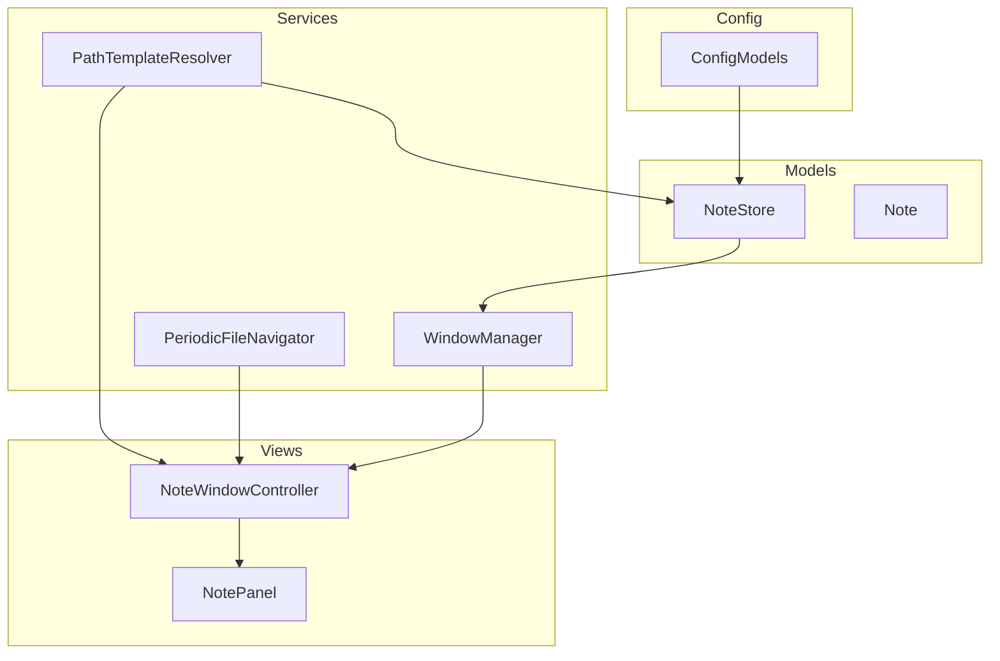
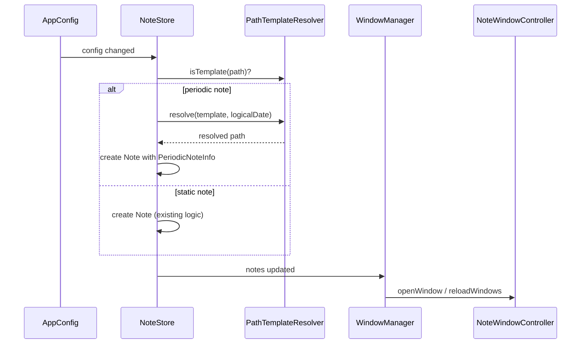
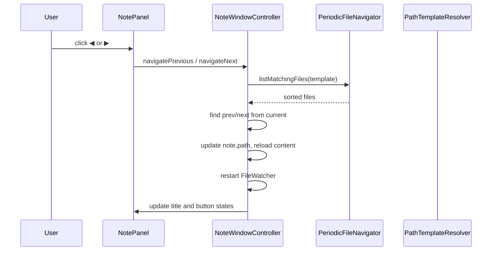
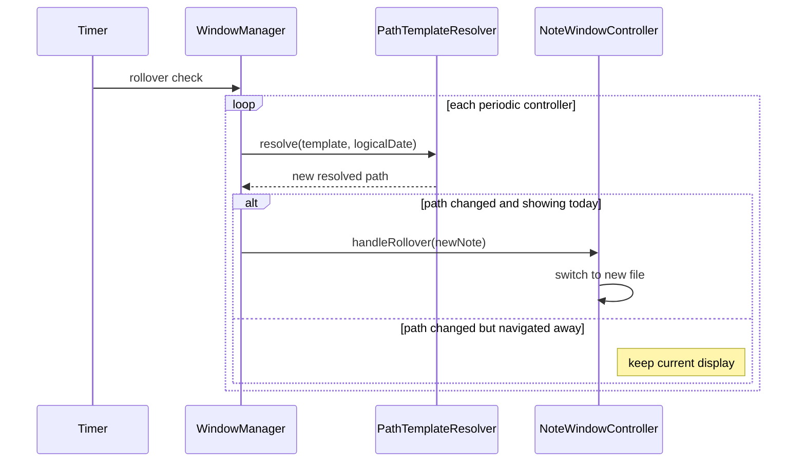
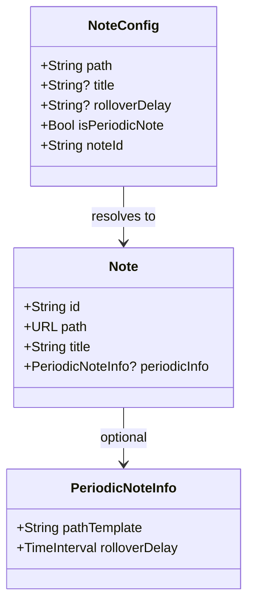

# Design Document: periodic-note

## Overview

**Purpose**: Periodic Note 機能は、config.yaml の `path` に `{...}` 日付テンプレートを記述することで、日付ベースのノートパスを自動解決し、タイトルバーからのナビゲーションと自動ロールオーバーを提供する。

**Users**: Obsidian で daily/weekly/monthly ノートを管理し、Fusen で参照・編集する開発者。

**Impact**: 既存の静的ノート機能に影響を与えず、テンプレートを含む `path` のみが periodic note として動作する。

### Goals

- `{...}` テンプレートによるパス自動解決（`period` フィールド不要）
- 既存ファイルのソートに基づくナビゲーション（◀/▶/Today）
- `rollover_delay` による深夜作業対応のロールオーバー制御
- 静的ノートとの完全な後方互換

### Non-Goals

- 未来のファイルへのナビゲーション（存在するファイルのみ対象）
- テンプレートからの期間（daily/weekly/monthly）自動推論
- ノートの削除・整理（Fusen のスコープ外。ファイルの自動作成は Req 2.2 で対応）

## Architecture

### Existing Architecture Analysis

現在の Fusen は以下のデータフローで動作する:

1. `AppConfig` (YAMLStore) → config.yaml を監視、`$data` を publish
2. `NoteStore` → `$data` を subscribe、`loadFromConfig()` で `[Note]` を構築
3. `WindowManager` → `NoteStore.notes` の変更で `reloadWindows()`
4. `NoteWindowController` → 1つの `Note` を管理、`FileWatcher` でファイル変更を監視

Periodic note はこのフローを拡張する形で統合する。

### Architecture Pattern & Boundary Map



**Architecture Integration**:

- **Selected pattern**: 既存のレイヤードアーキテクチャ（Config → Models → Services → Views）を維持
- **Domain boundaries**: テンプレート解決（PathTemplateResolver）とファイル検索（PeriodicFileNavigator）を独立したユーティリティとして分離
- **Existing patterns preserved**: Combine による reactive データフロー、`@MainActor` シングルトン、`onXxx` クロージャコールバック
- **New components rationale**: PathTemplateResolver は pure function で再利用可能、PeriodicFileNavigator はファイルシステム操作を分離
- **Steering compliance**: Models は Foundation のみに依存、Services は Foundation + Darwin のみ

### Technology Stack

| Layer | Choice / Version | Role in Feature | Notes |
|-------|------------------|-----------------|-------|
| UI | AppKit (NSButton, NSPanel) | タイトルバーのナビゲーションボタン | 既存の NotePanel 拡張 |
| Data | Foundation (FileManager, DateFormatter) | テンプレート解決、ファイル検索 | 追加依存なし |
| Runtime | Timer (Foundation) | ロールオーバー polling | 60秒間隔 |

追加の外部ライブラリは不要。

## System Flows

### テンプレート解決とノート表示フロー



### ナビゲーションフロー



### ロールオーバーフロー



## Requirements Traceability

| Requirement | Summary | Components | Interfaces | Flows |
|-------------|---------|------------|------------|-------|
| 1.1, 1.2, 1.3 | テンプレート検出・解決 | PathTemplateResolver, ConfigModels | `isTemplate()`, `resolve()`, `toGlobPattern()` | テンプレート解決フロー |
| 1.4 | ID 自動導出 | ConfigModels | `noteId` | — |
| 1.5 | rollover_delay 設定 | ConfigModels | `rolloverDelay`, `parseDuration()` | — |
| 1.6 | template ファイル設定 | ConfigModels | `template` フィールド | — |
| 2.1 | 論理日時でのテンプレート解決 | NoteStore, PathTemplateResolver | `loadFromConfig()`, `logicalDate()` | テンプレート解決フロー |
| 2.2 | テンプレートファイルからの作成 | NoteStore | `createFileFromTemplate()` | — |
| 2.3 | 空ファイル自動作成 | NoteStore | 既存の `writeContent()` を利用 | — |
| 2.4 | ディレクトリ自動作成 | NoteStore | 既存の `writeContent()` を利用 | — |
| 2.5 | bookmark スキップ | NoteStore | `loadFromConfig()` 内の分岐 | — |
| 3.1, 3.2 | タイトル表示 | NoteWindowController, NotePanel | `updateTitle()` | — |
| 4.1-4.7 | ファイルナビゲーション | PeriodicFileNavigator, NotePanel, NoteWindowController | `listMatchingFiles()`, `navigatePrevious()`, `navigateNext()` | ナビゲーションフロー |
| 5.1-5.3 | Today ボタン | NotePanel, NoteWindowController | `navigateToToday()`, `updateNavigationState()` | — |
| 6.1-6.4 | ロールオーバー | WindowManager, PathTemplateResolver | `startRolloverTimer()`, `handleRollover()` | ロールオーバーフロー |
| 7.1, 7.2 | ウィンドウ状態保持 | NoteWindowController | 既存の WindowState 永続化を利用 | — |

## Components and Interfaces

| Component | Domain/Layer | Intent | Req Coverage | Key Dependencies | Contracts |
|-----------|-------------|--------|--------------|-----------------|-----------|
| PathTemplateResolver | Services | テンプレート文字列の解決・判定 | 1.1-1.3 | Foundation (P2) | Service |
| PeriodicFileNavigator | Services | テンプレートマッチファイルの検索・ソート | 4.2-4.5 | PathTemplateResolver (P0), FileManager (P2) | Service |
| ConfigModels (拡張) | Config | rollover_delay パース、template パス、テンプレート ID 導出 | 1.4, 1.5, 1.6 | — | State |
| Note (拡張) | Models | PeriodicNoteInfo の保持 | 1.1-1.6 | ConfigModels (P0) | State |
| NoteStore (拡張) | Models | 論理日時によるテンプレート解決、テンプレートファイルからの作成 | 2.1-2.5 | PathTemplateResolver (P0) | Service |
| NotePanel (拡張) | Views | ナビゲーション UI | 4.1, 5.1-5.3 | — | — |
| NoteWindowController (拡張) | Views | ナビゲーション状態管理・ロールオーバー応答 | 3.1, 4.3-4.6, 5.2, 6.3-6.4 | PeriodicFileNavigator (P0), NoteStore (P0) | Service, State |
| WindowManager (拡張) | Services | ロールオーバータイマー管理 | 6.1-6.2 | PathTemplateResolver (P0) | Service |

### Services

#### PathTemplateResolver

| Field | Detail |
|-------|--------|
| Intent | `{...}` テンプレートの検出・解決・glob 変換を行う pure ユーティリティ |
| Requirements | 1.1, 1.2, 1.3 |

**Responsibilities & Constraints**

- テンプレート文字列内の `{...}` プレースホルダーを `DateFormatter` で日付文字列に置換
- テンプレートを glob パターンに変換（`{...}` → `*`）
- ファイル名からテンプレートのフォーマットで日付を逆パース
- Pure function、副作用なし

**Dependencies**

- External: Foundation (`DateFormatter`, `NSRegularExpression`) — テンプレートパース (P2)

**Contracts**: Service [x]

##### Service Interface

```swift
enum PathTemplateResolver {
    /// テンプレート文字列かどうかを判定
    static func isTemplate(_ path: String) -> Bool

    /// テンプレートを指定日付で解決し、展開済みパスを返す
    static func resolve(_ template: String, for date: Date) -> String

    /// テンプレートを glob パターンに変換（{...} → *）
    static func toGlobPattern(_ template: String) -> String

    /// 相対パスがテンプレートのフォーマットにマッチするか判定
    /// relativePath は baseDirectory からの相対パス（例: "2026/02/23.md"）
    /// 複数階層テンプレートでは filename ではなく相対パス全体で判定する
    static func matches(relativePath: String, template: String) -> Bool
}
```

- Preconditions: `template` は `~` 展開前の raw 文字列
- Postconditions: `resolve()` の返り値にはプレースホルダーが残らない
- Invariants: 同一の `(template, date)` ペアは常に同一の結果を返す

**Implementation Notes**

- 正規表現 `\{([^}]+)\}` でプレースホルダーを検出
- `matches()` は glob 結果の false positive フィルタに使用

#### PeriodicFileNavigator

| Field | Detail |
|-------|--------|
| Intent | テンプレートにマッチする既存ファイルの検索・ソート・ナビゲーション |
| Requirements | 4.2, 4.3, 4.4, 4.5 |

**Responsibilities & Constraints**

- テンプレートの glob パターンで親ディレクトリ内のファイルを検索
- `PathTemplateResolver.matches()` で false positive をフィルタ
- ファイル名の lexicographic sort で順序を決定
- 現在のファイルに対する前後のファイルを特定

**Dependencies**

- Inbound: NoteWindowController — ナビゲーション要求 (P0)
- Outbound: PathTemplateResolver — テンプレート解析 (P0)
- External: Foundation (`FileManager`) — ファイル列挙 (P2)

**Contracts**: Service [x]

##### Service Interface

```swift
enum PeriodicFileNavigator {
    /// テンプレートにマッチするファイル一覧をソート済みで返す
    /// baseDirectory はテンプレートの静的プレフィックス部分（{...} より前）のディレクトリ
    /// 複数階層テンプレートの場合は再帰的に列挙する
    static func listMatchingFiles(
        template: String,
        baseDirectory: URL
    ) -> [URL]

    /// ソート済みファイルリスト内で current の前のファイルを返す
    static func previousFile(
        from current: URL,
        in sortedFiles: [URL]
    ) -> URL?

    /// ソート済みファイルリスト内で current の次のファイルを返す
    static func nextFile(
        from current: URL,
        in sortedFiles: [URL]
    ) -> URL?
}
```

- Preconditions: `baseDirectory` は既存のディレクトリ
- Postconditions: 返り値のファイルリストはすべて `PathTemplateResolver.matches()` で検証済み

### Config

#### ConfigModels (拡張)

| Field | Detail |
|-------|--------|
| Intent | NoteConfig に `rollover_delay`, `template` フィールドと periodic note 判定を追加 |
| Requirements | 1.4, 1.5, 1.6 |

**Contracts**: State [x]

##### State Management

`NoteConfig` への追加:

```swift
// NoteConfig に追加するフィールド
var rolloverDelay: String?  // "2h", "30m" etc.
var template: String?       // テンプレートファイルパス（例: "~/notes/templates/daily.md"）

// CodingKeys に追加
case rolloverDelay = "rollover_delay"
case template

// Computed properties
var isPeriodicNote: Bool  // PathTemplateResolver.isTemplate(path)
```

`noteId` の変更:

- 静的ノート: 既存どおり `SHA256(resolvedPath).prefix(6)`
- Periodic note: `SHA256(path).prefix(6)` （テンプレート文字列そのまま）

Duration パースユーティリティ:

```swift
enum DurationParser {
    /// "2h" → 7200, "30m" → 1800, nil/"0" → 0
    static func parse(_ string: String?) -> TimeInterval
}
```

- サポート単位: `h`（時間）、`m`（分）
- 不正な文字列 → `0` にフォールバック

### Models

#### Note (拡張)

| Field | Detail |
|-------|--------|
| Intent | Periodic note の情報を Note に付加する |
| Requirements | 1.1-1.5 |

**Contracts**: State [x]

##### State Management

```swift
struct PeriodicNoteInfo: Equatable {
    let pathTemplate: String        // 元のテンプレート文字列
    let rolloverDelay: TimeInterval
    let templateFile: URL?          // 新規作成時のテンプレートファイル
}
```

`Note` に `var periodicInfo: PeriodicNoteInfo?` を追加。`nil` なら静的ノート。

#### NoteStore (拡張)

| Field | Detail |
|-------|--------|
| Intent | テンプレート検出、論理日時による解決、テンプレートファイルからのファイル作成 |
| Requirements | 2.1, 2.2, 2.3, 2.4, 2.5 |

**Contracts**: Service [x]

##### Service Interface

```swift
// NoteStore に追加するメソッド

/// 論理日時を計算する（現在日時 − rolloverDelay）
func logicalDate(rolloverDelay: TimeInterval) -> Date

/// NoteConfig から指定日付の Note を解決する
/// ファイルが存在しない場合は自動作成する（template 指定あり → テンプレートコピー、なし → 空ファイル）
/// 親ディレクトリが存在しない場合は自動作成する
func resolvePeriodicNote(
    from config: NoteConfig,
    for date: Date
) -> Note?
```

`resolvePeriodicNote()` の責務:

1. `PathTemplateResolver.resolve()` でパスを解決
2. 親ディレクトリが存在しない場合は `FileManager.createDirectory(withIntermediateDirectories: true)` で作成
3. ファイルが存在しない場合: `template` 指定あり → テンプレートファイルをコピー、なし → 空ファイル作成
4. `PeriodicNoteInfo` を生成して `Note` を構築
5. タイトル: `"configTitle — resolvedFileName"` 形式

`loadFromConfig()` の変更:

- `NoteConfig.isPeriodicNote` が `true` の場合:
  1. `logicalDate()` を計算
  2. `resolvePeriodicNote(from:for:)` を呼び出し（ファイル作成を含む）
  3. bookmark 解決をスキップ

### Views

#### NotePanel (拡張)

| Field | Detail |
|-------|--------|
| Intent | タイトルバーにナビゲーションボタン (◀/▶/●) を配置する |
| Requirements | 4.1, 5.1, 5.3 |

**Responsibilities & Constraints**

- 既存の `centerTitle()` を拡張し、ナビゲーションボタンを追加
- SF Symbols (`chevron.left`, `chevron.right`, `circle.fill`) を使用
- 静的ノートではボタンを非表示

**Contracts**: Service [x]

##### Service Interface

```swift
// NotePanel に追加するメソッド

/// ナビゲーションボタンをセットアップする
func setupNavigationButtons(
    target: AnyObject,
    prevAction: Selector,
    nextAction: Selector,
    todayAction: Selector
)

/// ボタンの有効/無効と Today ボタンの表示を更新する
func updateNavigationState(
    hasPrevious: Bool,
    hasNext: Bool,
    isToday: Bool
)
```

#### NoteWindowController (拡張)

| Field | Detail |
|-------|--------|
| Intent | ナビゲーション状態の管理、ロールオーバー応答 |
| Requirements | 3.1, 4.3, 4.4, 4.5, 4.6, 5.2, 6.3, 6.4 |

**Contracts**: Service [x] / State [x]

##### Service Interface

```swift
// NoteWindowController に追加するメソッド

/// 前のファイルにナビゲートする
func navigatePrevious()

/// 次のファイルにナビゲートする
func navigateNext()

/// 論理日時の（今日の）ノートに戻る
func navigateToToday()

/// ロールオーバーを処理する（WindowManager から呼び出し）
func handleRollover(_ newNote: Note)
```

##### State Management

```swift
// NoteWindowController に追加するプロパティ
private var isShowingToday: Bool = true  // 現在「今日」を表示中か
```

ナビゲーション時の処理:

1. `PeriodicFileNavigator` で前後のファイルを特定
2. `note.path` を更新
3. `contentModel` を新規作成（新ファイルの内容をロード）
4. `setupFileWatcher()` を再実行
5. パネルタイトルとナビゲーションボタン状態を更新

ロールオーバー時の処理:

- `isShowingToday == true` → `note` を新しいノートに差し替え、コンテンツ再ロード
- `isShowingToday == false` → 何もしない

### Services (拡張)

#### WindowManager (拡張)

| Field | Detail |
|-------|--------|
| Intent | ロールオーバータイマーの管理と periodic note コントローラへの通知 |
| Requirements | 6.1, 6.2 |

**Contracts**: Service [x]

##### Service Interface

```swift
// WindowManager に追加するメソッド

/// ロールオーバー用のタイマーを開始する
func startRolloverTimer()

/// ロールオーバー用のタイマーを停止する
func stopRolloverTimer()

/// 全 periodic note のロールオーバーチェックを実行する
func checkRollover()
```

`checkRollover()` のロジック:

1. `controllers` から `periodicInfo != nil` のコントローラを収集
2. 各コントローラについて、コントローラが保持する `periodicInfo.pathTemplate` と `rolloverDelay` を参照
3. `PathTemplateResolver.resolve(template, logicalDate)` で現在の論理日時のパスを解決
4. 解決結果がコントローラの現在表示中パス（`note.path`）と異なる場合、`NoteStore.resolvePeriodicNote()` で新しい `Note` を生成
5. 対応する `NoteWindowController.handleRollover(newNote)` を呼び出し

**Config reload との相互作用**: `NoteStore.loadFromConfig()` → `WindowManager.reloadWindows()` の際、既存の periodic note コントローラのナビゲーション状態（`isShowingToday`、現在表示中のパス）は保持される。`reloadWindows()` は `noteId` が一致するコントローラを再利用し、ナビゲーション中のユーザーの表示を中断しない。

タイマー管理:

- `reloadWindows()` 内で periodic note が1つでもあれば `startRolloverTimer()` を呼び出し
- 60秒間隔の `Timer.scheduledTimer` で `checkRollover()` を実行
- periodic note がなくなった場合は `stopRolloverTimer()` で停止

## Data Models

### Domain Model



**Business Rules & Invariants**:

- `NoteConfig.isPeriodicNote` が `true` ⇔ `path` に `{...}` プレースホルダーが含まれる
- Periodic note の `noteId` はテンプレート文字列の SHA256 先頭6文字
- 静的ノートの `noteId` は解決済みパスの SHA256 先頭6文字（既存動作維持）
- 同一テンプレートの異なる日付のファイルは同一の `noteId` を共有 → 同一ウィンドウで表示

### Config YAML 構造

```yaml
notes:
  # 静的ノート（既存、変更なし）
  - path: ~/notes/todo.md
    title: TODO

  # Periodic note（新規）
  - path: "~/notes/daily/{yyyy-MM-dd}.md"
    title: "Daily Note"
    color: blue
    rollover_delay: "2h"
    template: ~/notes/templates/daily.md
```

## Error Handling

### Error Strategy

| Error | 対処 |
|-------|------|
| テンプレート解決でパスが空 | 警告ログ、当該ノートをスキップ |
| glob でファイルが0件 | ◀/▶ ボタンを両方無効化 |
| `rollover_delay` の不正フォーマット | `0` にフォールバック、警告ログ |
| `template` ファイルが存在しない | 警告ログ、空ファイルにフォールバック |
| ファイル作成失敗（権限エラー等） | 既存の `writeContent()` のエラーハンドリングを利用 |
| `DateFormatter` のフォーマット不正 | 空文字列が返る → ファイルが見つからない → 空ファイル作成 |

## Testing Strategy

### Unit Tests

- `PathTemplateResolver.isTemplate()`: テンプレート検出の正常系・異常系
- `PathTemplateResolver.resolve()`: 単一/複数プレースホルダー、各フォーマットパターン
- `PathTemplateResolver.matches()`: マッチ判定、false positive 排除
- `DurationParser.parse()`: `"2h"`, `"30m"`, `"0"`, `nil`, 不正値
- `NoteConfig.noteId`: 静的ノートとperiodic noteで異なるID導出

### Integration Tests

- `NoteStore.loadFromConfig()`: periodic note を含む config からの Note 生成
- `PeriodicFileNavigator.listMatchingFiles()`: テスト用ディレクトリでの検索・フィルタ・ソート
- ナビゲーション: ◀/▶ によるファイル切り替えと contentModel の更新
- ロールオーバー: テンプレート解決結果の変化検知と通知
