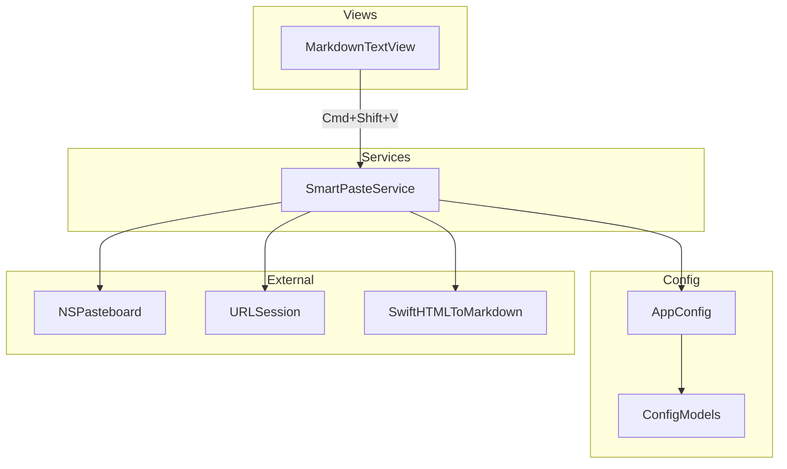
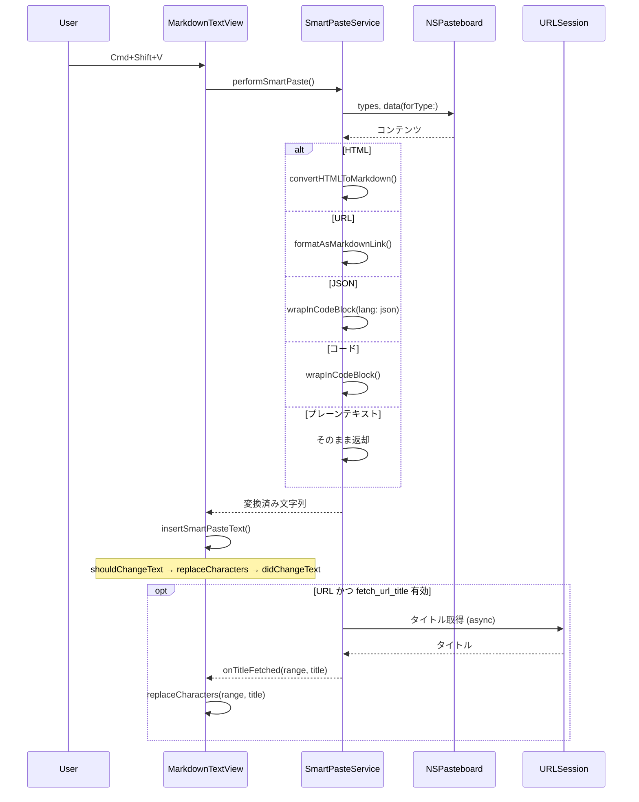
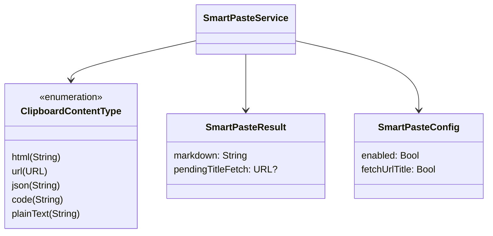

# Design Document: Smart Paste

## Overview

**Purpose**: クリップボードの内容を Markdown 形式に自動変換してペーストする機能を提供し、ノート入力の摩擦を軽減する。

**Users**: Chirami ユーザーが、ブラウザ・エディタ・ターミナルからコピーしたコンテンツを `Cmd+Shift+V` で構造を保持したまま Markdown としてノートに取り込む。

**Impact**: 既存の `MarkdownTextView` にキーバインド分岐を追加し、新規 `SmartPasteService` で変換ロジックを処理する。`Cmd+V` の既存動作は変更しない。

### Goals

- `Cmd+Shift+V` で HTML / URL / JSON / コードを適切な Markdown に変換して挿入
- コンテンツ種別の自動判定 (HTML → URL → JSON → コード → プレーンテキスト)
- `config.yaml` による機能の有効/無効制御
- 既存の Undo/Redo・ファイル保存・再スタイリングパイプラインとの統合

### Non-Goals

- `Cmd+V` の動作変更
- HTML テーブルの Markdown 変換 (SwiftHTMLToMarkdown の制約)
- 画像のペースト対応
- リッチテキスト以外のバイナリコンテンツ (PDF, ファイル等) の処理

## Architecture

### Existing Architecture Analysis

現在の MarkdownTextView は `performKeyEquivalent(with:)` でキーボードショートカットを処理している (`MarkdownTextView.swift:185-216`)。テキスト挿入は `shouldChangeText` → `storage.replaceCharacters` → `didChangeText` パターンで Undo サポートとファイル保存を連鎖させる。設定は `AppConfig.shared` 経由で `YAMLStore<ChiramiConfig>` から Reactive に配信される。

### Architecture Pattern & Boundary Map



**Architecture Integration**:

- **Selected pattern**: Service + View Extension — 変換ロジックを SmartPasteService に集約し、MarkdownTextView から呼び出す
- **Existing patterns preserved**: Closure ベースのコールバック、`@MainActor` シングルトン、YAMLStore による Reactive 設定管理
- **New components rationale**: SmartPasteService は変換・判定ロジックの単一責務を担い、View 層との疎結合を維持する
- **Steering compliance**: Services 層に配置し、レイヤードアーキテクチャの依存方向を遵守

### Technology Stack

| Layer | Choice / Version | Role in Feature | Notes |
|-------|------------------|-----------------|-------|
| UI | AppKit (NSTextView) | キーバインド検出・テキスト挿入 | 既存 |
| Services | SmartPasteService | コンテンツ判定・変換 | 新規 |
| HTML 変換 | SwiftHTMLToMarkdown | HTML → Markdown | 新規依存、SPM |
| ネットワーク | URLSession | URL タイトル取得 | 既存フレームワーク |
| Config | YAMLStore / Yams | 設定管理 | 既存 |

## System Flows

### Smart Paste フロー



## Requirements Traceability

| Requirement | Summary | Components | Interfaces | Flows |
|-------------|---------|------------|------------|-------|
| 1.1 | Cmd+V は通常ペースト | MarkdownTextView | — | — |
| 1.2 | Cmd+Shift+V でスマートペースト | MarkdownTextView | performSmartPaste | Smart Paste フロー |
| 1.3 | フォーカス外では無視 | MarkdownTextView | — | — |
| 2.1 | コンテンツ種別の優先順位判定 | SmartPasteService | detectContentType | Smart Paste フロー |
| 2.2 | 該当なしはプレーンテキスト | SmartPasteService | convert | Smart Paste フロー |
| 3.1-3.5 | HTML → Markdown 変換 | SmartPasteService | convertHTMLToMarkdown | Smart Paste フロー |
| 4.1-4.5 | URL → Markdown リンク | SmartPasteService | formatAsMarkdownLink, fetchTitle | Smart Paste フロー |
| 5.1-5.2 | JSON/コード → コードブロック | SmartPasteService | wrapInCodeBlock | Smart Paste フロー |
| 6.1-6.4 | 設定管理 | SmartPasteConfig, AppConfig | config.smartPaste | — |

## Components and Interfaces

| Component | Domain/Layer | Intent | Req Coverage | Key Dependencies | Contracts |
|-----------|-------------|--------|--------------|-----------------|-----------|
| SmartPasteService | Services | コンテンツ判定・変換 | 2.1, 2.2, 3.1-3.5, 4.1-4.5, 5.1-5.2 | NSPasteboard (P0), SwiftHTMLToMarkdown (P0), URLSession (P1) | Service |
| SmartPasteConfig | Config | 設定モデル | 6.1-6.4 | — | State |
| MarkdownTextView (拡張) | Views | キーバインド・テキスト挿入 | 1.1-1.3 | SmartPasteService (P0), AppConfig (P1) | — |

### Services

#### SmartPasteService

| Field | Detail |
|-------|--------|
| Intent | クリップボードのコンテンツ種別を判定し、Markdown に変換する |
| Requirements | 2.1, 2.2, 3.1-3.5, 4.1-4.5, 5.1-5.2 |

**Responsibilities & Constraints**

- NSPasteboard からコンテンツを読み取り、種別を判定
- 種別に応じた Markdown 変換を実行
- URL タイトルの非同期取得とコールバック通知
- `@MainActor` シングルトンとして動作

**Dependencies**

- Outbound: NSPasteboard — クリップボード読み取り (P0)
- External: SwiftHTMLToMarkdown — HTML 変換 (P0)
- Outbound: URLSession — URL タイトル取得 (P1)
- Inbound: AppConfig — 設定読み取り (P1)

**Contracts**: Service [x]

##### Service Interface

```swift
enum ClipboardContentType {
    case html(String)
    case url(URL)
    case json(String)
    case code(String)
    case plainText(String)
}

struct SmartPasteResult {
    let markdown: String
    let pendingTitleFetch: URL?  // nil でなければ非同期タイトル取得が必要
}

@MainActor
final class SmartPasteService {
    static let shared = SmartPasteService()

    func detectContentType() -> ClipboardContentType
    func convert(_ content: ClipboardContentType) -> SmartPasteResult
    func fetchTitle(for url: URL) async -> String?
}
```

- Preconditions: NSPasteboard にデータが存在すること
- Postconditions: 変換済み Markdown 文字列を返却。変換不能な場合はプレーンテキストをそのまま返却
- Invariants: 入力データを破壊しない。ネットワーク障害時はフォールバック値を返却

**Implementation Notes**

- HTML 変換: `BasicHTML(rawHTML:).parse()` → `.asMarkdown()` で変換。パースエラー時はプレーンテキストにフォールバック
- URL 判定: `URL(string:)` で生成し、`scheme` が `http`/`https` であることを確認
- JSON 判定: `JSONSerialization.jsonObject(with:)` でパース可能か検証
- コード判定: 複数行かつインデントパターン、または中括弧・セミコロンなどの構文要素の存在で簡易判定
- タイトル取得: URLSession で HTML を取得し、`<title>` タグまたは `og:title` メタタグを抽出。タイムアウト 5 秒

### Config

#### SmartPasteConfig

| Field | Detail |
|-------|--------|
| Intent | Smart Paste 機能の設定を定義する Codable モデル |
| Requirements | 6.1-6.4 |

**Contracts**: State [x]

##### State Management

```swift
struct SmartPasteConfig: Codable {
    var enabled: Bool
    var fetchUrlTitle: Bool

    enum CodingKeys: String, CodingKey {
        case enabled
        case fetchUrlTitle = "fetch_url_title"
    }
}
```

デフォルト値: `enabled = true`, `fetchUrlTitle = true`

`ChiramiConfig` に `smartPaste: SmartPasteConfig?` として追加。`nil` の場合はデフォルト値を使用。

**Implementation Notes**

- `CodingKeys` で snake_case ↔ camelCase マッピング (既存パターン準拠)
- `YAMLStore` のファイル監視により、設定変更はアプリ再起動なしで反映 (6.4)

### Views

#### MarkdownTextView (拡張)

| Field | Detail |
|-------|--------|
| Intent | Cmd+Shift+V のキーバインド検出と変換済みテキストの挿入 |
| Requirements | 1.1-1.3 |

**Implementation Notes**

- `performKeyEquivalent(with:)` に `[.command, .shift]` + `"v"` の分岐を追加
- `Cmd+V` は `super.performKeyEquivalent(with:)` にフォールスルーし、既存動作を維持
- 挿入は既存の `shouldChangeText` → `replaceCharacters` → `didChangeText` パターンを使用
- URL タイトル非同期更新のため、挿入時のプレースホルダ `NSRange` を保持し、`onTitleFetched` コールバックで置換

## Data Models

### Domain Model



- **ClipboardContentType**: クリップボードの内容を種別で分類する enum。Associated value で元データを保持
- **SmartPasteResult**: 変換結果と非同期処理の必要性を伝達する値型
- **SmartPasteConfig**: YAML から読み込む設定モデル

## Error Handling

### Error Strategy

Smart Paste は「失敗してもプレーンテキストに安全にフォールバック」する設計。ユーザーに明示的なエラー表示は行わない。

### Error Categories and Responses

**HTML パースエラー**: SwiftHTMLToMarkdown がパースに失敗 → クリップボードのプレーンテキスト (`.string`) をそのまま挿入

**URL タイトル取得失敗**: ネットワークエラー / タイムアウト (5秒) / パースエラー → URL 自身をリンクテキストに使用 (`[URL](URL)`)

**JSON パースエラー**: `JSONSerialization` が失敗 → コード判定にフォールスルー

**クリップボード空**: データなし → 何もしない (no-op)

## Testing Strategy

### Unit Tests

- `SmartPasteService.detectContentType()`: 各コンテンツ種別の判定ロジック
- `SmartPasteService.convert()`: HTML / URL / JSON / コード / プレーンテキストの変換結果
- `SmartPasteConfig`: YAML デコード・デフォルト値の検証

### Integration Tests

- `MarkdownTextView` + `SmartPasteService`: Cmd+Shift+V でスマートペーストが発動し、変換結果が挿入されること
- `AppConfig` 変更時に SmartPaste の有効/無効が即時反映されること

### E2E Tests

- ブラウザからコピーした HTML が Markdown として挿入されること
- URL ペースト時にプレースホルダが挿入され、タイトル取得後に更新されること
