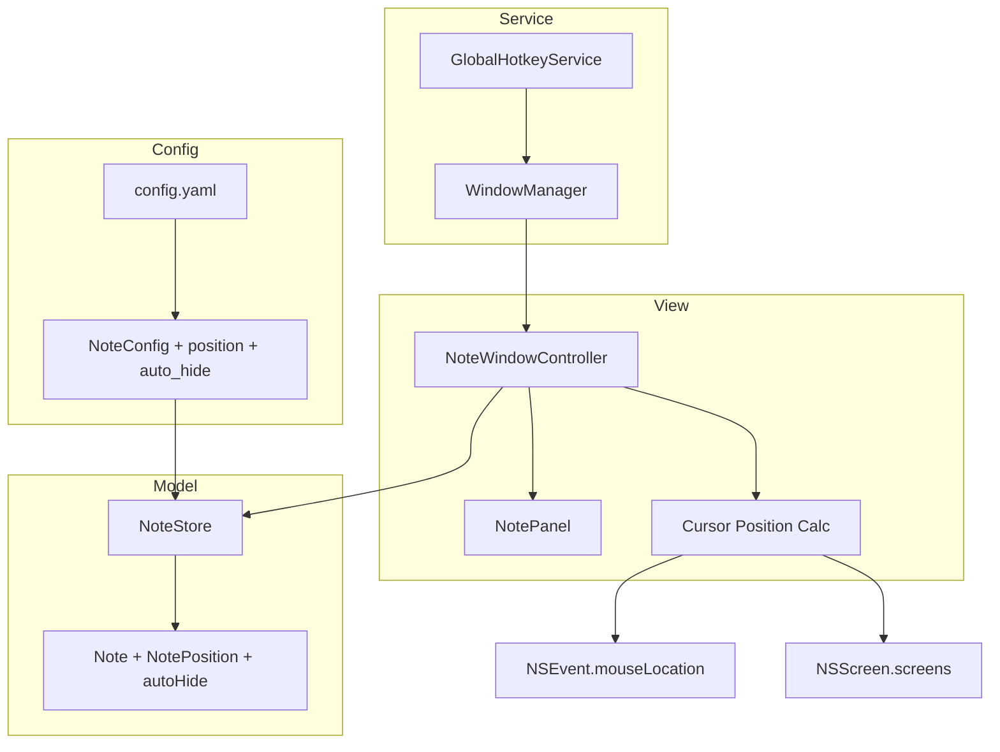
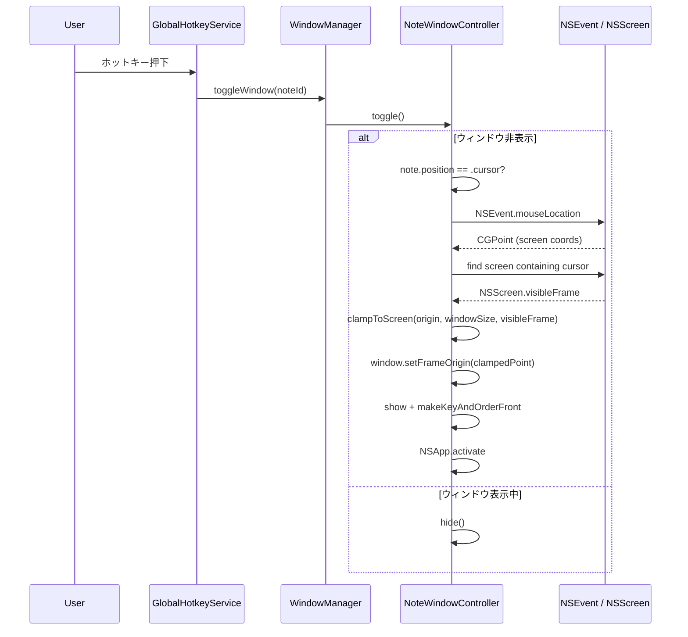
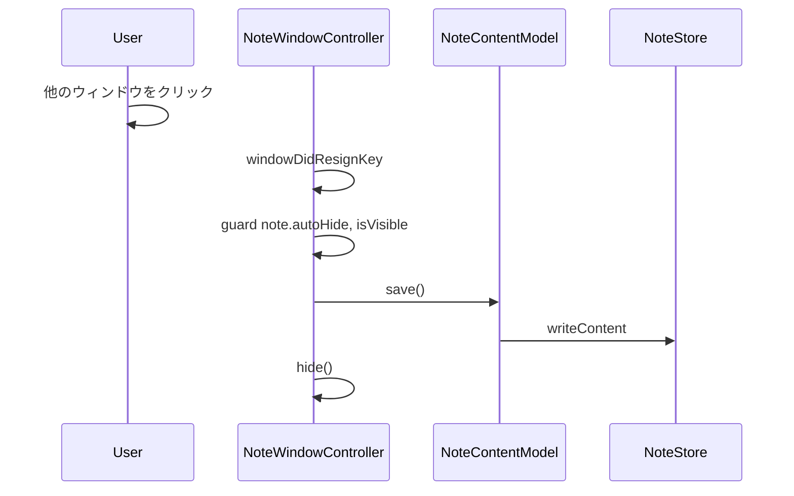
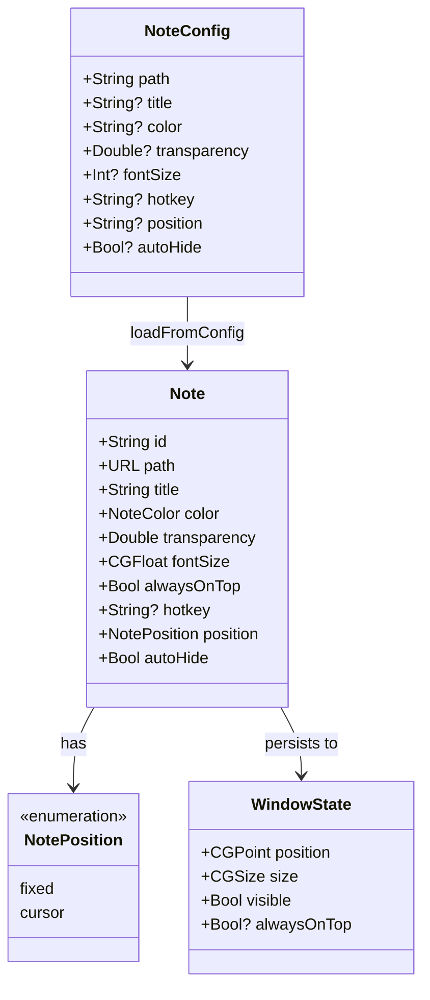

# Design Document: transient-window

## Overview

**Purpose**: Transient Window は、グローバルホットキーでマウスカーソル位置にノートをポップアップし、フォーカス離脱で自動非表示にする機能を提供する。作業中のコンテキスト移動をゼロにし、「書く」という瞬間的なアクションに特化する。

**Users**: コーディング中にメモを取りたい開発者、ターミナルログを一時退避したいユーザーが、ホットキー一つでカーソル位置にノートを呼び出す。

**Impact**: 既存の `NoteConfig` / `Note` モデルに `position` / `autoHide` フィールドを追加し、`NoteWindowController` と `WindowManager` の表示・非表示ロジックを拡張する。

### Goals

- マウスカーソル位置へのウィンドウポップアップ（画面境界補正・マルチディスプレイ対応）
- フォーカス離脱による自動非表示と自動保存
- config.yaml への宣言的な設定追加（`position`, `auto_hide`）
- 既存ノートの動作を一切変更しない後方互換性

### Non-Goals

- カーソル位置以外の動的ポジションモード（例: 画面中央固定）
- アニメーション付きのポップアップ/非表示トランジション
- Transient Window 専用のUI（通常のノートウィンドウと同じ外観を使用）
- ウィンドウサイズのカーソル位置基準の自動調整

## Architecture

### Existing Architecture Analysis

既存のChiramiアーキテクチャは以下のレイヤー構造を持つ:

- **Config層**: `AppConfig` / `AppState` → YAMLファイルの読み書き
- **Model層**: `NoteConfig` → `Note` → `NoteStore` のデータフロー
- **Service層**: `WindowManager` / `GlobalHotkeyService` → ウィンドウ管理とホットキー登録
- **View層**: `NotePanel` / `NoteWindowController` → 個別ウィンドウのライフサイクル

本機能はこの全レイヤーを薄く拡張する形で実装する。新規ファイルの追加は不要。

### Architecture Pattern & Boundary Map



**Architecture Integration**:

- **Selected pattern**: 既存レイヤー構造の拡張。各レイヤーにOptionalフィールドとguard条件を追加
- **Existing patterns preserved**: シングルトン（NoteStore/WindowManager）、Combine購読によるホットリロード、config/state分離
- **New components rationale**: 新規コンポーネントなし。カーソル位置計算は `NoteWindowController` のprivateメソッドとして実装

### Technology Stack

| Layer | Choice / Version | Role in Feature | Notes |
|-------|------------------|-----------------|-------|
| UI | AppKit NSPanel | ウィンドウ表示・フォーカス管理 | 既存NotePanel活用 |
| API | NSEvent.mouseLocation | カーソル位置取得 | スクリーン座標（左下原点） |
| API | NSScreen | マルチディスプレイ検出・画面境界取得 | `visibleFrame` で実効領域取得 |
| Data | Yams (YAML) | config.yaml拡張フィールドの永続化 | 既存依存、変更なし |

## System Flows

### ホットキー押下 → カーソル位置表示フロー



### フォーカス離脱 → 自動非表示フロー



## Requirements Traceability

| Requirement | Summary | Components | Interfaces | Flows |
|-------------|---------|------------|------------|-------|
| 1.1 | カーソル位置にウィンドウ表示 | NoteWindowController | showAtCursor() | ホットキー→表示 |
| 1.2 | 画面境界補正 | NoteWindowController | clampToScreen() | ホットキー→表示 |
| 1.3 | 左上座標をカーソル位置に設定 | NoteWindowController | showAtCursor() | ホットキー→表示 |
| 1.4 | マルチディスプレイ対応 | NoteWindowController | screenForCursor() | ホットキー→表示 |
| 2.1 | フォーカス離脱で自動非表示 | NoteWindowController | windowDidResignKey | 自動非表示 |
| 2.2 | 非表示時の自動保存 | NoteWindowController, NoteContentModel | save(), hide() | 自動非表示 |
| 2.3 | 未設定ノートの既存動作維持 | NoteWindowController | windowDidResignKey guard | - |
| 2.4 | ホットキー優先制御 | NoteWindowController | isVisible guard | ホットキー→非表示 |
| 3.1 | position フィールド | NoteConfig, Note | NotePosition enum | - |
| 3.2 | auto_hide フィールド | NoteConfig, Note | autoHide: Bool | - |
| 3.3 | position 未指定時のフォールバック | NoteStore | loadFromConfig() | - |
| 3.4 | auto_hide 未指定時のデフォルト | NoteStore | loadFromConfig() | - |
| 3.5 | ホットリロード | NoteStore | Combine subscription | - |
| 4.1 | 位置の永続化スキップ | NoteWindowController | saveWindowState() | - |
| 4.2 | サイズのみ永続化 | NoteWindowController, AppState | saveWindowState() | - |
| 4.3 | 起動時デフォルト非表示 | WindowManager | openWindow() | - |
| 5.1 | 未設定ノートの動作維持 | All | Optional fields | - |
| 5.2 | 全体トグルからの除外 | WindowManager | toggleAllWindows() | - |
| 5.3 | メニューバー表示 | NoteListView | 変更なし | - |

## Components and Interfaces

| Component | Domain/Layer | Intent | Req Coverage | Key Dependencies | Contracts |
|-----------|-------------|--------|--------------|------------------|-----------|
| NoteConfig | Config | position/auto_hide フィールド追加 | 3.1, 3.2, 3.3, 3.4 | Yams (P2) | State |
| Note / NotePosition | Model | NotePosition enum とモデル拡張 | 3.1, 3.2 | なし | State |
| NoteStore | Model | Config→Noteマッピング拡張 | 3.3, 3.4, 3.5 | AppConfig (P0) | State |
| NoteWindowController | View | カーソル配置・auto-hide | 1.1-1.4, 2.1-2.4, 4.1, 4.2 | NoteStore (P0), NSEvent (P0) | Service |
| WindowManager | Service | トグル制御・起動時制御 | 4.3, 5.2 | NoteWindowController (P0) | Service |

### Config層

#### NoteConfig

| Field | Detail |
|-------|--------|
| Intent | config.yamlの `position` / `auto_hide` フィールドを受け付ける |
| Requirements | 3.1, 3.2, 3.3, 3.4 |

**Responsibilities & Constraints**

- `position: String?` — 値は `"cursor"` または nil（未指定 = 固定位置）
- `autoHide: Bool?` — nil の場合デフォルト `false`
- `CodingKeys` に `position` と `autoHide = "auto_hide"` を追加
- 既存フィールドへの影響なし（Optionalで追加）

##### State Management

```swift
struct NoteConfig: Codable {
    // ... existing fields ...
    var position: String?
    var autoHide: Bool?

    enum CodingKeys: String, CodingKey {
        case path, title, color, transparency, hotkey, position
        case fontSize = "font_size"
        case autoHide = "auto_hide"
    }
}
```

### Model層

#### Note / NotePosition

| Field | Detail |
|-------|--------|
| Intent | ノートの位置モードとauto-hide設定をモデルに反映する |
| Requirements | 3.1, 3.2 |

**Responsibilities & Constraints**

- `NotePosition` enum で位置モードを型安全に表現
- `Note` struct に `position: NotePosition` と `autoHide: Bool` を追加
- `Equatable` 準拠の `==` 演算子に新フィールドを含める

##### State Management

```swift
enum NotePosition: Equatable {
    case fixed
    case cursor
}

struct Note: Identifiable, Equatable {
    // ... existing fields ...
    var position: NotePosition = .fixed
    var autoHide: Bool = false
}
```

#### NoteStore (拡張)

| Field | Detail |
|-------|--------|
| Intent | Config→Note変換時に新フィールドをマッピングする |
| Requirements | 3.3, 3.4, 3.5 |

**Implementation Notes**

- `loadFromConfig()` 内で `NoteConfig.position` を `NotePosition` に変換: `"cursor"` → `.cursor`、それ以外 → `.fixed`
- `NoteConfig.autoHide` を `?? false` でデフォルト値適用
- ホットリロードは既存の `AppConfig.$data` → `NoteStore.$notes` → `NoteWindowController.applyNoteUpdate()` の購読チェーンで対応。`applyNoteUpdate()` が `position`/`autoHide` を含む全フィールドを同期するため、config.yaml変更が即座にコントローラーに反映される

### View層

#### NoteWindowController (拡張)

| Field | Detail |
|-------|--------|
| Intent | カーソル追従表示・auto-hide・状態永続化制御 |
| Requirements | 1.1-1.4, 2.1-2.4, 4.1, 4.2 |

**Responsibilities & Constraints**

- `note` プロパティを `let` → `var` に変更し、ホットリロード時に `position`/`autoHide` を含む全フィールドを同期可能にする
- カーソル位置でのウィンドウ表示（`show()` メソッド拡張）
- フォーカス離脱時の自動非表示（`windowDidResignKey` 追加）
- 位置永続化のスキップ（`saveWindowState()` 条件分岐）
- サイズのみ永続化（cursor モードの場合）

**Dependencies**

- Inbound: WindowManager → toggle/show呼び出し (P0)
- Outbound: NoteStore → 状態保存 (P0)
- External: NSEvent.mouseLocation → カーソル位置取得 (P0)
- External: NSScreen.screens → ディスプレイ情報 (P0)

**Contracts**: Service [x] / State [x]

##### Service Interface

```swift
extension NoteWindowController {
    // カーソル位置にウィンドウを表示する
    // Precondition: note.position == .cursor
    // Postcondition: ウィンドウがカーソル位置（画面内補正済み）に表示される
    func showAtCursor()

    // カーソルが存在するスクリーンを特定する
    // Postcondition: カーソル位置を含むNSScreenを返す。見つからない場合はNSScreen.mainにフォールバック
    func screenForCursor() -> NSScreen?

    // ウィンドウ位置を画面内にクランプする
    // Precondition: origin はカーソル位置、windowSize は現在のウィンドウサイズ
    // Postcondition: 返却されるCGPointはvisibleFrame内に収まる
    func clampToScreen(origin: CGPoint, windowSize: CGSize, visibleFrame: CGRect) -> CGPoint

    // NSWindowDelegate: フォーカス離脱時のauto-hide処理
    // Precondition: note.autoHide == true かつ isVisible == true
    // Postcondition: コンテンツ保存後、ウィンドウが非表示になる
    func windowDidResignKey(_ notification: Notification)
}
```

##### State Management

```swift
// saveWindowState() の拡張ロジック:
// - note.position == .cursor の場合:
//   - windowDidMove: 保存をスキップ（位置は揮発的）
//   - windowDidResize: 既存stateからpositionを読み取り、新しいsizeと合わせて保存
//     → AppState.updateWindow API は変更不要（position + size をセットで渡す）
// - note.position == .fixed の場合: 従来通り位置・サイズ両方保存
```

```swift
// applyNoteUpdate() の拡張ロジック（ホットリロード対応）:
// 既存の color, transparency, title, alwaysOnTop, fontSize に加え、
// position と autoHide も同期する
private func applyNoteUpdate(_ updated: Note) {
    // ... existing updates ...
    note.position = updated.position
    note.autoHide = updated.autoHide
}
```

**Implementation Notes**

- `note` プロパティを `let` → `var` に変更。`applyNoteUpdate()` で `position`/`autoHide` を含む全フィールドを同期し、ホットリロード（3.5）に対応
- `showAtCursor()` は `NSEvent.mouseLocation` でスクリーン座標を取得し、`clampToScreen()` で補正後、`window.setFrameOrigin()` で配置
- `windowDidResignKey` は `guard note.autoHide, isVisible else { return }` で既存ノートへの影響を排除。`autoHide` は `applyNoteUpdate` で常に最新値が保持される
- `isVisible` チェックにより、ホットキーによる明示的非表示後の二重処理を防止（`research.md` Decision参照）
- `show()` メソッド内で `note.position` を判定し、`.cursor` なら `showAtCursor()` を呼び出す分岐を追加
- 表示時に `NSApp.activate(ignoringOtherApps: true)` と `makeKeyAndOrderFront(nil)` でキーボードフォーカスを確保
- cursorモードの `windowDidMove` では `saveWindowState()` を呼ばない。`windowDidResize` 時は `noteStore.windowState(for: note)` から既存positionを読み取り、新しいsizeと合わせて `saveWindowState()` に渡す。これにより `AppState.updateWindow` API の変更なしで要件4.1/4.2を実現する

### Service層

#### WindowManager (拡張)

| Field | Detail |
|-------|--------|
| Intent | 全体トグルからのauto-hideノート除外、起動時制御 |
| Requirements | 4.3, 5.2 |

**Contracts**: Service [x]

##### Service Interface

```swift
extension WindowManager {
    // toggleAllWindows() の拡張:
    // auto_hide ノートをトグル対象から除外
    // Postcondition: autoHide == true のノートの表示状態は変更されない

    // openWindow(for:) の拡張:
    // auto_hide + cursor のノートはウィンドウ作成のみ（表示しない）
    // Postcondition: コントローラーは作成されるが、showIfNeeded は呼ばれない
}
```

**Implementation Notes**

- `toggleAllWindows()`: `controllers.values` のフィルタリングで `note.autoHide == false` のコントローラーのみ対象
- `openWindow(for:)`: `note.autoHide && note.position == .cursor` の場合、`showIfNeeded()` をスキップ

## Data Models

### Domain Model



**変更点のみ記載**:

- `NoteConfig`: `position: String?`, `autoHide: Bool?` を追加
- `Note`: `position: NotePosition`, `autoHide: Bool` を追加
- `NotePosition`: 新規enum（`.fixed`, `.cursor`）
- `WindowState`: 構造変更なし（cursor モード時は position の書き込みをスキップするのみ）

### Physical Data Model

**config.yaml の拡張表現**:

```yaml
notes:
  - id: scratch
    path: ~/Desktop/scratch.md
    position: cursor        # NEW: "cursor" | absent (= fixed)
    auto_hide: true          # NEW: true | false | absent (= false)
    hotkey: cmd+shift+n
```

**state.yaml の挙動変更**:

- `position: cursor` のノート: `windows[noteId].position` フィールドは更新されない（初期値 or 前回値が残る）
- `windows[noteId].size` は通常通り更新される

## Error Handling

### Error Strategy

本機能は既存のエラーハンドリングパターンに準拠する。新たなエラーカテゴリは導入しない。

**フォールバック動作**:

- カーソル位置取得失敗 → `NSScreen.main` のセンターにフォールバック
- 該当スクリーンなし → `NSScreen.main` にフォールバック
- config.yamlの `position` に不正な値 → `.fixed` にフォールバック（未知の文字列は無視）

## Testing Strategy

### 手動テスト項目

- **カーソル追従表示**: ホットキー押下でカーソル位置にウィンドウが表示されるか
- **画面端補正**: 画面右下隅にカーソルを置いた状態でウィンドウが画面内に収まるか
- **マルチディスプレイ**: 外部ディスプレイ上でカーソル追従が正しく動作するか
- **Auto-hide**: 他のウィンドウをクリックした際に自動非表示されるか
- **Auto-hide + 保存**: 自動非表示後にファイル内容が保存されているか
- **ホットキートグル**: ホットキーでの表示/非表示が正しく動作するか（二重非表示なし）
- **全体トグル除外**: グローバルホットキーでauto-hideノートがトグルされないか
- **既存ノート互換**: 設定未変更のノートが従来通り動作するか
- **ホットリロード**: config.yaml変更後に `position` / `auto_hide` が反映されるか
- **起動時非表示**: アプリ起動時にtransientノートが表示されないか
