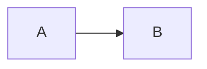

# Features

## Markdown Live Preview

Chirami renders Markdown in an Obsidian-style Live Preview: the block containing the cursor shows raw Markdown, while all other blocks are rendered.

**Supported syntax:**

- Headings (H1–H6)
- **Bold** (`**text**`, `__text__`)
- *Italic* (`*text*`, `_text_`)
- ~~Strikethrough~~ (`~~text~~`)
- ==Highlight== (`==text==`) — Obsidian-compatible
- Inline code (`` `code` ``)
- Links (`[text](url)`) — clickable
- Wiki links (`[[Page]]`, `[[Page|Alias]]`, `[[Page#Heading]]`) — Obsidian-compatible; rendered as clickable links that resolve to local files. See [Wiki Links](configuration.md#wiki-links).
- Images (``) — rendered inline, fits to window width. See [Images](advanced.md#images).
- Unordered lists (`-`, `*`)
- Ordered lists (`1.`, `2.`)
- Task lists (`- [ ]`, `- [x]`) — clickable checkboxes
- Nested lists
- Blockquotes (`>`)
- Obsidian callouts (`> [!type] title`) — styled callout blocks with colored border, background, and icon
- Code blocks with syntax highlighting (triple backticks with optional language)
- Mermaid diagrams (` ```mermaid ` blocks) — rendered as SVG when cursor is outside the block
- Excalidraw diagrams (` ```excalidraw ` blocks) — rendered as SVG preview; hover to show Edit button, click to open fullscreen Excalidraw editor overlay
- Tables (GitHub Flavored Markdown pipe syntax) — rendered as HTML tables; click a cell to edit it in place. See [Table editing](#editor-features).
- Thematic breaks (`---`, `***`, `___`)
- `<details>`/`<summary>` HTML blocks — rendered as collapsible sections; click anywhere on the summary to expand/collapse

## Window Operations

**Always on Top** — Note windows float above all other windows by default. Set `always_on_top: false` in config.yaml to disable.

**Dragging** — Hold the drag modifier key (default: Cmd) and drag anywhere in the note window to move it. The modifier can be changed with `drag_modifier` in config.yaml.

**Theme** — Configured per note in config.yaml (`theme: yellow/blue/green/pink/purple/gray`). Themes are defined via CSS custom properties — see [CSS Theming](css-theming.md) for customization.

**Transparency** — Configured per note in config.yaml (`transparency: 0.0–1.0`). Only the note background is translucent; text, widgets and the title bar contents stay fully opaque so the note remains readable over any window behind it.

**Pin** — All notes show a pin button (📌) at the right end of the title bar. It is revealed on title bar hover while the note is unpinned, and stays visible while pinned. While pinned, the note stays visible even when focus moves to another window. Unpinned notes hide automatically when they lose focus. Pin state is persisted in state.yaml across restarts. Default: `cursor` notes start unpinned, `fixed` notes start pinned. Shortcut: **Cmd+Option+P**.

**Window Warp** — While a note window is focused, press the warp modifier key (default: Ctrl+Option) + H/J/K/L or the arrow keys to instantly move the window to one of 9 positions in a 3×3 grid. The grid uses configurable display-edge gaps (`warp_margin`), which default to 8pt on all four sides. Movement wraps around at the edges — pressing H (or ←) at the left column jumps to the right column of the same row. The current grid position is inferred from the window's actual position, so warp works naturally after manual dragging. In multi-monitor setups, the window warps within the screen it currently occupies. Warp position is persisted across restarts. The same modifier also scales the window with `=` / `-`. The modifier key is configurable via `warp_modifier` in `config.yaml`.

## Editor Features

**Slash command** — Type `/` at the start of an empty line to open a command picker. Type to filter, ↑/↓ to navigate, Enter to insert, Escape to dismiss. Available commands:

- `/excalidraw` — Insert an Excalidraw diagram block and open the editor overlay immediately
- `/mermaid` — Insert a Mermaid code block with a starter template
- `/details` — Insert a collapsible `<details>` block with the summary text selected
- `/table` — Insert a 2×2 Markdown table template

**Mermaid diagrams** — Use `/mermaid` to insert a ` ```mermaid ` block with a starter template. When the cursor is outside the block, the diagram renders as an SVG. To constrain the rendered size, add `width` and/or `height` to the opening fence:

````

````

**Excalidraw diagrams** — Use `/excalidraw` to insert a ` ```excalidraw ` block and open the fullscreen editor immediately. When the cursor is outside the block, the diagram renders as an SVG preview. Hover and click **Edit**, or press **Mod+Enter** inside the block, to reopen the editor. Diagram data is stored as JSON in the code block — the `.md` file stays plain text.

To constrain the rendered size, add `width` and/or `height` to the opening fence:

````
```excalidraw width=600 height=300
{...}
```
````

**Excalidraw Library** — Add reusable shape libraries via `config.yaml`. Libraries from [libraries.excalidraw.com](https://libraries.excalidraw.com/) can be downloaded as `.excalidrawlib` files and loaded directly. Items added inside the editor are saved separately and persist across sessions.

```yaml
excalidraw:
  libraries:
    - ~/.config/chirami/excalidraw/my-library.excalidrawlib
```

**Obsidian Callouts** — Blockquotes starting with `> [!type]` are rendered as styled callout blocks (colored border, background, icon). All standard Obsidian callout types are supported: `note`, `tip`, `warning`, `danger`, `success`, `question`, `failure`, `abstract`, `example`, `quote`, and their aliases. The title defaults to the type name if omitted.

**Table editing** — Tables render as HTML tables when the cursor is outside them. Click a cell to edit it in place:

- **Tab / Shift+Tab** — Move to the next / previous cell. Tab on the last cell appends a new row.
- **Enter** — Move to the cell below.
- **Escape** — Discard the edit.

Changes are committed when you navigate to another cell or the editor loses focus. To edit the raw Markdown instead, hover over the table and click the `</>` button — the cursor jumps to the clicked cell. Tables inside blockquotes or lists, and cells containing escapes beyond `\\` and `\|`, fall back to raw Markdown editing.

**Task list toggle** — Cmd+L converts the current line to/from a task list item (`- [ ]`). Click a checkbox to toggle it.

**List auto-continuation** — Press Enter on a list item to continue the list with the next marker. Press Enter on an empty list item to end the list.

**Text surround** — Select text and type a bracket or quote character to wrap the selection. Supported pairs:

- `*`, `_`, `` ` ``, `~`, `=` (wrap with same character — type `=` twice to make `==highlight==`)
- `(`, `[`, `{` (wrap with matching close bracket)
- `"`, `'` (wrap with same quote)

**Indent / Dedent** — Press Tab on a list item line to indent it (adds one level). Press Shift+Tab to dedent. With multiple lines selected, Tab and Shift+Tab indent or dedent all selected lines at once. Tab and Shift+Tab on non-list lines behave normally.

**Image Paste** — Paste an image from the clipboard (Cmd+V) to save it as a PNG file and insert a Markdown image link. See [Images](advanced.md#images).

**Find** — Cmd+F opens the find bar.

**Font size** — Cmd+= / Cmd+- to increase or decrease the font size (range: 8–32).

**Window size** — Press the warp modifier (default: Ctrl+Option) with `=` or `-` to scale the note window up or down while preserving its current aspect ratio. The resized frame is clamped within the same `warp_margin` display-edge gaps used by Window Warp and cursor-positioned notes. If the configured warp modifier conflicts with the built-in `Cmd+=` / `Cmd+-` font shortcuts, the font shortcuts take precedence.

**Link click** — Click a rendered link to open it in the default browser.

**Link open from caret** — Place the cursor inside a markdown link and press Cmd+Enter or Option+Enter to open the URL in the default browser. Works in both regular text and task list items.

**Wiki links** — `[[Page]]`, `[[Page|Alias]]`, and `[[Page#Heading]]` render as clickable links (the brackets are hidden; an alias is shown instead of the target). Click a link, or press Cmd+Enter with the cursor inside it, and Chirami resolves the target to a local `.md` file and opens it with a configurable command — for example in Obsidian or your editor. Resolution looks first next to the source note, then for the shortest match under the vault root (the nearest `.obsidian` directory, or a configured `vault`). The open command and vault can be set globally or per note. This first version resolves to the **file** only — `#heading` / `^block` jumps and `![[embeds]]` are not yet supported. See [Wiki Links](configuration.md#wiki-links).

## Keyboard Shortcuts

See [Keyboard Shortcuts](shortcuts.md) for the full reference.

## Menu Bar

Chirami lives in the macOS menu bar. Click the icon to open the popover:

> Set `show_menu_bar_icon: false` in config.yaml to hide the menu bar icon. In that case, use the global hotkey to toggle notes.

- **Note list** — Each note is shown with its color indicator and title. Click to toggle visibility. A checkmark indicates the note is currently visible.
- **Show All / Hide All** — Toggle all notes at once.
- **Edit Config** — Open `~/.config/chirami/config.yaml` in your default editor.
- **Quit Chirami** — Exit the application.

## CLI

See [CLI](cli.md) for usage details.

## External Editor Sync

Chirami watches note files for changes. Edits made in Obsidian, VS Code, or any other editor are reflected immediately in the Chirami window.
