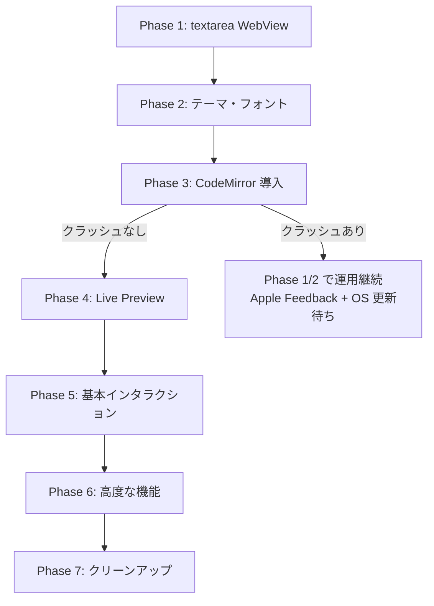

# WebView エディタ移行計画

作成日: 2026-04-10
ステータス: **完了**（2026-04-12）

## 背景

現在の Live Preview エディタは NSTextView + NSLayoutManager ベースのカスタム実装で、約 3,600 行の Swift コードで成り立っている。`docs/performance-issues.md` にある通り、構造的な課題が残っている。

- 毎キーストロークで全文パースとレイアウト再計算が走る（インクリメンタル更新が困難）
- CJK と ASCII が混在する行の高さが安定しない
- 描画コストが表示領域に比例し、ウィンドウが大きいほど CPU が上がる
- 描画の残像のような問題が完全には解消しない

Obsidian は CodeMirror 6 を採用することで同じ Live Preview 体験を少ない CPU で実現している。本計画では最終的にレンダリング層を WKWebView + CodeMirror 6 に置き換える。

## 過去の試行と反省

`feat/web-view` ブランチで一発実装を試みたが、以下の問題で頓挫した。

- 起動時・マウス移動時・キー入力時にクラッシュが多発
- 一度に実装した量が多く、原因の切り分けができなかった
- クラッシュは macOS 26.4 beta の WebKit バグ（`swift_task_isMainExecutorImpl` の nil executor）と推測されているが、CodeMirror 固有の問題か WKWebView 全般の問題かすら判別できていない

詳細は `docs/webkit-crash-investigation.md` を参照。

**今回の再実装では、クラッシュの原因切り分けを最優先とし、段階的に機能を積み上げる。**

## ゴール

- Obsidian 風 Live Preview（カーソル行だけ生 Markdown、他はレンダリング）の実現
- `config.yaml` 形式（`color_schemes`、フォント、ノート割り当て）を 100% 維持
- 既存のユーザー操作（チェックボックス、画像、折りたたみ、Smart Paste、ショートカット）をすべて再現
- 旧 NSTextView 関連コードの削除による保守コスト削減
- 安定した行高・スムーズな入力・低 CPU の実現

## 非ゴール

- UI/UX の見た目を現行実装と完全一致させること
- ウィンドウ管理・ホットキー・ファイル I/O の再設計（既存を継続利用）
- `config.yaml` / `state.yaml` のフォーマット変更

## 戦略: 段階的な切り分け

クラッシュ原因を特定しつつ前進できるよう、以下の順で機能を積み上げる。



### 各 Phase の位置付け

| Phase | ゴール | 使用技術 | 切り分けの意味 |
|-------|--------|----------|----------------|
| Phase 1 | textarea WebView で読み書き | HTML `<textarea>` + WKWebView | WKWebView 自体がクラッシュしないか |
| Phase 2 | テーマとフォントを反映 | CSS 変数 + Swift 注入 | ブリッジ経由の再描画が安定するか |
| Phase 3 | CodeMirror ベア構成 | CodeMirror 6（拡張なし） | `contenteditable` + CodeMirror がクラッシュの原因かを確定 |
| Phase 4 | Live Preview 実装 | CodeMirror Decoration API | Obsidian 風体験の実装 |
| Phase 5 | ショートカット・チェックボックス | CodeMirror keymap + WidgetType | 基本操作を揃える |
| Phase 6 | 画像・折りたたみ・Smart Paste | custom scheme + WidgetType | 高度な機能を揃える |
| Phase 7 | 旧実装の削除 | — | 保守コスト削減 |

### Phase 3 が Go/No-go ポイント

Phase 3 で CodeMirror を導入した結果がその後の方針を決める。

- **クラッシュしない場合**: Phase 4 以降を実装する
- **クラッシュする場合**: Phase 1/2 の `<textarea>` 実装を暫定運用とし、Apple Feedback と次の macOS beta を待つ。Phase 4 以降は WebKit バグ修正後に再開

## 各フェーズドキュメント

- [phase-1-textarea.md](phase-1-textarea.md) — textarea WebView と基盤ブリッジ ✅
- [phase-2-theme-font.md](phase-2-theme-font.md) — テーマ・フォント統合 ✅
- [phase-3-codemirror.md](phase-3-codemirror.md) — CodeMirror 導入とクラッシュ検証 ✅
- [phase-4-live-preview.md](phase-4-live-preview.md) — Live Preview 実装 ✅
- [phase-5-interactions.md](phase-5-interactions.md) — 基本インタラクション ✅
- [phase-6-advanced-features.md](phase-6-advanced-features.md) — 画像・折りたたみ・Smart Paste ✅
- [phase-7-cleanup.md](phase-7-cleanup.md) — 旧実装削除とクリーンアップ ✅

## 全体アーキテクチャ（最終形）

```
┌──────────────────────────────────────────────────┐
│  NSPanel (既存: NoteWindow.swift)                │
│  ├─ NoteContentView (SwiftUI)                    │
│  │   └─ NoteWebView (新規)                       │
│  │       └─ WKWebView                            │
│  │           └─ index.html + bundle.js           │
│  │               └─ CodeMirror 6 EditorView      │
│  └─ NoteContentModel (既存: 内容保持)            │
└──────────────────────────────────────────────────┘
```

```
データフロー:
[File]
  ↕ (NoteStore: 既存)
[NoteContentModel.text]
  ↕ (NoteWebView via evaluateJavaScript / WKScriptMessageHandler)
[CodeMirror 6 state または textarea]
```

## ディレクトリ構成（最終形）

```
chirami/
├─ editor-web/                         # JS ソース（npm 管理）
│  ├─ package.json
│  ├─ tsconfig.json
│  ├─ index.html                       # ビルド対象
│  ├─ src/
│  │  ├─ main.ts                       # エントリポイント
│  │  ├─ editor.ts                     # Phase 3 以降: CodeMirror セットアップ
│  │  ├─ bridge.ts                     # Swift ↔ JS メッセージング
│  │  ├─ theme.ts                      # CSS 変数テーマ
│  │  ├─ style.css                     # エディタ全体の CSS
│  │  └─ extensions/                   # Phase 4 以降
│  │     ├─ livePreview.ts
│  │     ├─ checkbox.ts
│  │     ├─ image.ts
│  │     ├─ foldMarkdown.ts
│  │     └─ smartPaste.ts
│  └─ scripts/
│     └─ copy-html.js                  # index.html コピー
├─ Chirami/Resources/editor/           # ビルド成果物（コミット対象）
│  ├─ index.html
│  ├─ bundle.js
│  └─ bundle.css
├─ Chirami/Views/
│  └─ NoteWebView.swift                # WKWebView ラッパー
└─ Chirami/Services/
   ├─ NoteWebViewBridge.swift          # メッセージハンドラ
   └─ LocalImageSchemeHandler.swift    # Phase 6: chirami-img:// scheme
```

## 削除対象（Phase 7 で実施）

```
Chirami/Views/
├─ LivePreviewEditor.swift
├─ MarkdownTextView.swift
└─ MarkdownTextView+ListEditing.swift

Chirami/Editor/
├─ BulletLayoutManager.swift
├─ MarkdownStyler.swift
├─ MarkdownStyler+*.swift
├─ TableOverlayView.swift
├─ InlineMarkupRenderer.swift
├─ EditorStatePreservable.swift
└─ ImageCache.swift
```

依存ライブラリからの削除対象: `swift-markdown`、`Highlightr`

## 参考資料

- [CodeMirror 6 公式](https://codemirror.net/)
- [@codemirror/lang-markdown](https://github.com/codemirror/lang-markdown)
- [codemirror-rich-markdoc（参考実装）](https://github.com/segphault/codemirror-rich-markdoc)
- [WKWebView Programming Guide](https://developer.apple.com/documentation/webkit/wkwebview)
- [turndown (HTML→MD)](https://github.com/mixmark-io/turndown)
- `docs/webkit-crash-investigation.md` — 前回の実装で遭遇したクラッシュ調査
- `docs/performance-issues.md` — 現行実装の課題
